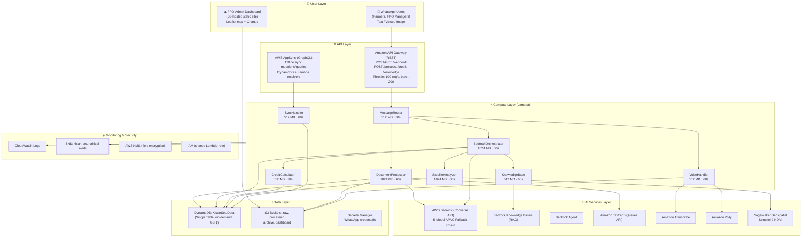
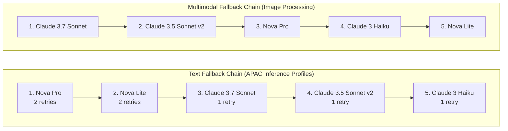
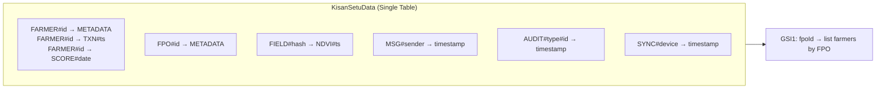
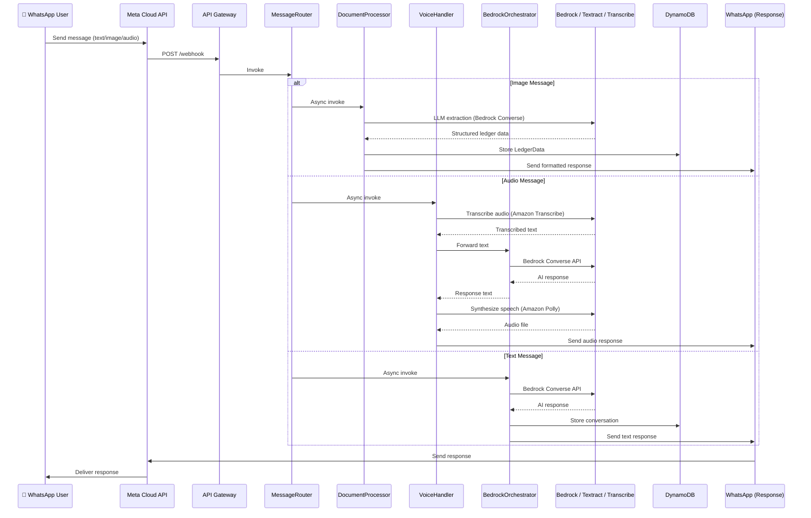
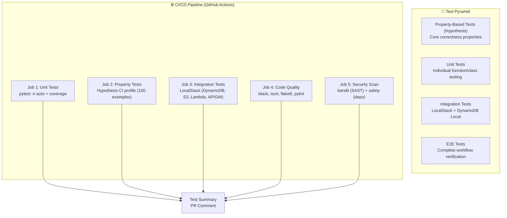
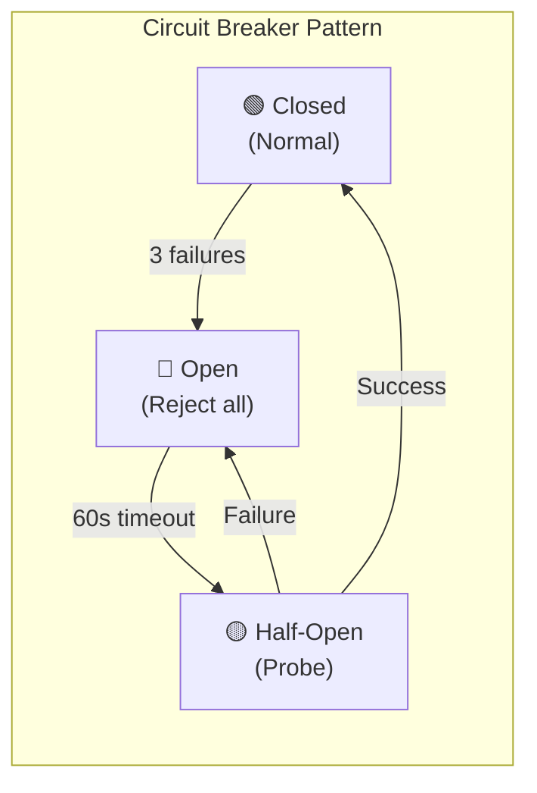
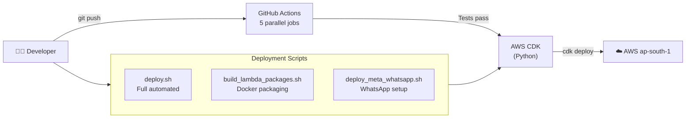

# Kisan-Setu MVP — Architecture Document

> Comprehensive architecture reference derived from a line-by-line codebase audit.
> Last updated: March 9, 2026

---

## 1. Executive Summary

Kisan-Setu is a serverless, AI-powered WhatsApp assistant for Indian farmers and Farmer Producer Organizations (FPOs). It digitizes handwritten ledgers, provides agricultural advice, calculates credit scores, analyzes satellite imagery for crop health, and supports voice interactions in Hindi and regional languages — all through WhatsApp with zero UI.

The system is built entirely on AWS managed services (Lambda, DynamoDB, Bedrock, Textract, Transcribe, Polly, SageMaker Geospatial, AppSync, API Gateway) and deployed via AWS CDK (Python). It targets a cost of less than $50/month per FPO serving 500+ farmers.

---

## 2. High-Level System Architecture



---

## 3. Project Structure (Actual)

```
kisan-setu-mvp/
├── app.py                          # CDK app entry point
├── infrastructure_stack.py         # Single CDK stack (KisanSetuMVPStack)
├── cdk.json                        # CDK config (Python 3.11 runtime)
├── schema.graphql                  # AppSync GraphQL schema
├── requirements.txt                # Python deps (CDK, boto3, hypothesis, etc.)
├── seed_data.py                    # DynamoDB seed script (FPO, farmers, txns)
├── Dockerfile.lambda               # Lambda container build
├── deploy.sh / deploy_meta_whatsapp.sh / build_lambda_packages.sh
├── pytest.ini                      # Test config (markers: property, integration, e2e)
│
├── lambda/
│   ├── common/                     # Shared modules (copied into each Lambda)
│   │   ├── models.py               # Dataclasses: Message, LedgerData, NDVIResult, etc.
│   │   ├── dynamodb_access.py      # DynamoDBAccess class — CRUD for all entities
│   │   ├── validation.py           # GPS, phone, NDVI, crop, moisture validators
│   │   ├── error_handling.py       # CircuitBreaker, retry, CriticalErrorAlerter (SNS)
│   │   ├── llm_adapter.py          # LLMAdapter — 5-model fallback, circuit breakers
│   │   ├── cost_optimization.py    # CacheManager, TextractBatcher, ConcurrentProcessor
│   │   ├── encryption.py           # EncryptionService — KMS + Fernet field encryption
│   │   ├── ledger_formatter.py     # Multilingual ledger response formatting
│   │   └── error_handler_example.py
│   │
│   ├── router/router.py            # MessageRouter Lambda handler
│   ├── processor/processor.py      # DocumentProcessor Lambda handler
│   ├── orchestrator/orchestrator.py # BedrockOrchestrator Lambda handler
│   ├── voice/voice.py + voice_agent.py  # VoiceHandler Lambda
│   ├── credit/credit.py            # CreditEngine + handler
│   ├── satellite/satellite_analyzer.py + satellite_mock.py
│   ├── knowledge/knowledge_base.py # Bedrock Knowledge Base handler
│   ├── sync/sync_handler.py + sync_manager.py
│   └── whatsapp/meta_whatsapp_interface.py + webhook_handler.py
│
├── dashboard/                      # S3-hosted FPO admin dashboard
│   ├── index.html
│   └── app.js
│
├── tests/                          # 55+ test files
│   ├── conftest.py, generators.py, mock_services.py
│   └── ... (property-based, unit, integration tests)
│
├── docs/
│   ├── demo_video_script.md
│   └── presentation_outline.md
│
└── .github/workflows/test.yml      # CI/CD pipeline
```


---

## 4. Lambda Functions — Detailed Breakdown

### 4.1 MessageRouter (`lambda/router/router.py`)

| Property | Value |
|----------|-------|
| Runtime | Python 3.11 |
| Memory | 512 MB |
n| Timeout | 30s |
| Handler | `router.handler` |

Entry point for all WhatsApp traffic. Responsibilities:

- **Webhook verification**: Handles Meta's `GET` challenge-response (`hub.verify_token` = `kisan-setu-verify-2026`)
- **Message parsing**: Extracts sender, message type, content from Meta webhook payload
- **Routing logic**: Inspects message type and invokes the appropriate downstream Lambda:
  - `image` → DocumentProcessor (async `lambda:InvokeFunction`)
  - `audio` → VoiceHandler (async invoke)
  - `text` → BedrockOrchestrator (async invoke)
- **Language detection**: Heuristic text-based detection (Hindi/Marathi/Tamil) + DynamoDB farmer preference lookup
- **Message metadata storage**: Writes message metadata to DynamoDB (`MSG#{message_id}`)
- **Duplicate detection**: Checks `message_id` to prevent reprocessing

### 4.2 DocumentProcessor (`lambda/processor/processor.py`)

| Property | Value |
|----------|-------|
| Runtime | Python 3.11 |
| Memory | 1024 MB |
| Timeout | 60s |
| Handler | `processor.handler` |

Processes handwritten ledger images. Key design decision: **multimodal LLM-first with Textract fallback**.

- **Image acquisition**: Downloads image from WhatsApp via media API, uploads to S3 (`kisan-setu-raw-{acct}`)
- **LLM extraction** (`_extract_with_multimodal_llm`): Sends image to Bedrock Converse API (multimodal chain) with structured extraction prompt for quantity, moisture, price, date, crop type, farmer name
- **Multi-entry support**: Parses multiple ledger entries from a single image (`_parse_llm_response_multi`)
- **Textract fallback**: If LLM extraction fails, falls back to Textract Queries API
- **Post-processing**: LLM-based field refinement and sanitization
- **Validation**: Confidence scoring per field, flags fields below threshold for review
- **Aggregation**: `aggregate_ledgers()` computes totals, averages, weighted prices across multiple entries
- **Batch processing**: `process_batch_ledgers()` handles multiple images with error isolation
- **Storage**: Writes structured `LedgerData` to DynamoDB, sends formatted response via WhatsApp

### 4.3 BedrockOrchestrator (`lambda/orchestrator/orchestrator.py`)

| Property | Value |
|----------|-------|
| Runtime | Python 3.11 |
| Memory | 1024 MB |
| Timeout | 60s |
| Handler | `orchestrator.handler` |

Central AI brain. Handles all text-based interactions.

- **ModelRouter**: Classifies queries into tiers (simple/medium/complex) for cost-optimized model selection
- **Intent detection**: Pattern-matching for credit score, satellite, ledger, knowledge base queries
- **Sub-Lambda invocation**: Calls CreditCalculator, SatelliteAnalyzer, KnowledgeBase via `lambda:InvokeFunction`
- **Voice ledger creation**: Parses transaction data from text messages, creates ledger entries
- **Conversation context**: Stores/retrieves conversation history from DynamoDB (last 6 messages)
- **5-model fallback**: Uses `LLMAdapter` for Bedrock Converse API calls
- **Static fallback**: If all models fail, returns a hardcoded helpful response
- **Cost tracking**: Records token usage per tier for daily cost monitoring

### 4.4 VoiceHandler (`lambda/voice/voice.py` + `voice_agent.py`)

| Property | Value |
|----------|-------|
| Runtime | Python 3.11 |
| Memory | 512 MB |
| Timeout | 60s |
| Handler | `voice.handler` |

End-to-end voice pipeline:

1. Downloads audio from WhatsApp media API → uploads to S3
2. `VoiceAgent.transcribe_audio()`: Starts Amazon Transcribe async job, polls for completion
   - Supports: Hindi (`hi-IN`), Marathi (`mr-IN`), Tamil (`ta-IN`)
   - Audio formats: OGG, MP3, WAV, M4A (auto-detected)
   - Retry logic for job creation
3. Sends transcribed text to BedrockOrchestrator for AI response
4. `VoiceAgent.synthesize_speech()`: Converts response to audio via Amazon Polly
   - Neural engine, Indian voices (Aditi for Hindi, etc.)
   - Uploads audio to S3, generates presigned URL
5. Sends audio response back via WhatsApp

### 4.5 CreditCalculator (`lambda/credit/credit.py`)

| Property | Value |
|----------|-------|
| Runtime | Python 3.11 |
| Memory | 512 MB |
| Timeout | 30s |
| Handler | `credit.handler` |

`CreditEngine` computes a 0-100 reliability score from 5 weighted components:

| Component | Max Points | Sub-metrics |
|-----------|-----------|-------------|
| Supply Consistency | 30 | Frequency (10), Adherence (10), Fulfillment (10) |
| Quality Metrics | 25 | Moisture (10), Grade Consistency (10), Rejection Rate (5) |
| Transaction History | 20 | Volume (10), Relationship Length (5), Success Rate (5) |
| Financial Behavior | 15 | Payment Timeliness (10), Outstanding Dues (5) |
| Operational Transparency | 10 | Digitization Rate (5), Data Completeness (5) |

- Queries farmer transactions from DynamoDB
- Stores score with timestamp (`SCORE#{date}`)
- Detects significant changes (>10 points) and triggers notifications
- Maintains score history for trend analysis

### 4.6 SatelliteAnalyzer (`lambda/satellite/satellite_analyzer.py`)

| Property | Value |
|----------|-------|
| Runtime | Python 3.11 |
| Memory | 1024 MB |
| Timeout | 60s |
| Handler | `satellite_analyzer.handler` |

- **Live mode**: SageMaker Geospatial API for Sentinel-2 satellite imagery
  - Generates bounding box from GPS coordinates
  - Retrieves Band 4 (Red) and Band 8 (NIR) for NDVI calculation
  - NDVI = (NIR - Red) / (NIR + Red), range [-1.0, 1.0]
- **Mock mode** (`SatelliteMock`): Deterministic NDVI generation for demo
  - Scoped to Maharashtra geographic bounds
  - 8 crop types with realistic yield ranges
  - Hash-based determinism (same coords + date = same result)
- **Yield prediction**: Based on NDVI history trends
  - Maturity stages: Early, Mid, Late, Harvest Ready
  - Confidence intervals from cloud cover analysis
- **Caching**: DynamoDB-backed 24-hour cache for satellite imagery

### 4.7 KnowledgeBase (`lambda/knowledge/knowledge_base.py`)

| Property | Value |
|----------|-------|
| Runtime | Python 3.11 |
| Memory | 512 MB |
| Timeout | 60s |
| Handler | `knowledge_base.handler` |

RAG-based agricultural knowledge retrieval:

- `retrieve`: Vector search against Bedrock Knowledge Base
- `retrieve_and_generate`: Full RAG pipeline (retrieve + LLM generation)
- Domain-specific helpers: FPO guidelines, farming practices, quality standards, credit criteria
- Cost optimization: Reduces long-context prompting by ~40%

### 4.8 SyncHandler (`lambda/sync/sync_handler.py`)

| Property | Value |
|----------|-------|
| Runtime | Python 3.11 |
| Memory | 512 MB |
| Timeout | 60s |
| Handler | `sync_handler.handler` |

AppSync Lambda resolver for offline sync:

- Handles `syncOfflineTransactions` GraphQL mutation
- Sorts transactions chronologically before processing
- **Conflict resolution**: Last-write-wins (higher version number wins)
- Reports: success count, failure count, conflict details with resolution


---

## 5. Shared Common Modules (`lambda/common/`)

### 5.1 Data Models (`models.py`)

Dataclasses matching the DynamoDB single-table design:

| Model | Key Fields |
|-------|-----------|
| `Message` | message_id, sender_id, message_type (TEXT/VOICE/IMAGE), content, language |
| `LedgerData` | ledger_id, farmer_id, quantity, moisture, price, crop_type, confidence_scores |
| `NDVIResult` | field_id, gps_coords, ndvi_value (-1.0 to 1.0), confidence |
| `YieldPrediction` | field_id, estimated_volume, confidence_interval, maturity_stage |
| `ReliabilityScore` | farmer_id, total_score (0-100), 5 component scores, score_change |
| `Transaction` | transaction_id, farmer_id, fpo_id, quantity, crop_type, quality_grade, sync_status |
| `Farmer` | farmer_id, name, phone, fpo_id, gps_coords, preferred_language |
| `FPO` | fpo_id, name, location, manager_contact, member_count |
| `AuditTrail` | audit_id, entity_type, entity_id, operation, changed_fields, previous_values |

### 5.2 LLM Adapter (`llm_adapter.py`)

The core AI resilience layer:



- **Circuit breaker** per model: Opens after 3 failures, 60s timeout, half-open probe
- **Exponential backoff**: 1s → 2s → 4s for retryable errors (throttling, timeout, 5xx)
- **Token tracking**: Input/output token counts per request

### 5.3 DynamoDB Access (`dynamodb_access.py`)

Centralized data access layer with methods for all entities:

- CRUD for Farmer, FPO, Transaction, ReliabilityScore, NDVIResult, Message
- Date range queries for transactions
- Credit score history retrieval
- Audit trail creation (automatic on create/update operations)
- Pending sync management for offline devices

### 5.4 Error Handling (`error_handling.py`)

- `ErrorCategory` enum: VALIDATION, AUTHENTICATION, AUTHORIZATION, NOT_FOUND, RATE_LIMIT, SERVICE_ERROR, AI_ERROR, NETWORK_ERROR
- `ErrorSeverity` enum: LOW, MEDIUM, HIGH, CRITICAL
- `get_localized_message()`: Error messages in English, Hindi, Marathi, Tamil
- `CircuitBreaker`: Generic circuit breaker for any service
- `retry_with_exponential_backoff()`: Configurable retry decorator
- `CriticalErrorAlerter`: Publishes to SNS topic for critical errors
- `process_batch_with_resilience()`: Batch processing with per-item error isolation

### 5.5 Cost Optimization (`cost_optimization.py`)

- `CacheManager`: DynamoDB-backed cache with TTL (satellite imagery, Bedrock responses)
- `TextractBatcher`: Batches multiple document processing requests
- `ConcurrentProcessor`: Thread pool for parallel processing

### 5.6 Encryption (`encryption.py`)

- `EncryptionService`: AWS KMS data key generation + Fernet symmetric encryption
- Field-level encryption for sensitive data (price, phone, financial_behavior)
- Format: `base64(encrypted_key):base64(ciphertext)`
- Sensitive field definitions per entity type

### 5.7 Validation (`validation.py`)

- GPS coordinates: -90 to 90 lat, -180 to 180 lon
- Indian phone numbers: +91/91/10-digit, starting with 6-9
- Language codes: hi-IN, mr-IN, ta-IN
- NDVI: [-1.0, 1.0], Confidence: [0.0, 1.0], Reliability: [0, 100]
- Quality grades: A, B, C
- Crop types: onion, wheat, rice, cotton, soybean, maize
- Moisture: [0, 100]%

### 5.8 Ledger Formatter (`ledger_formatter.py`)

- Multilingual response formatting for extracted ledger data
- Market reference price comparison
- Suspicious price detection
- Localized labels (Hindi, Marathi, Tamil, English)


---

## 6. Data Architecture

### 6.1 DynamoDB Single Table Design

**Table**: `KisanSetuData` (on-demand billing, PK/SK key schema)

| Entity | PK | SK | Key Attributes |
|--------|----|----|----------------|
| Farmer | `FARMER#{farmer_id}` | `METADATA` | name, phone, fpo_id, gps_coords, preferred_language |
| Transaction | `FARMER#{farmer_id}` | `TXN#{timestamp}` | quantity, crop_type, quality_grade |
| Credit Score | `FARMER#{farmer_id}` | `SCORE#{date}` | total_score, component_scores |
| FPO | `FPO#{fpo_id}` | `METADATA` | name, location, member_count |
| NDVI Result | `FIELD#{coords_hash}` | `NDVI#{timestamp}` | ndvi_value, confidence |
| Message | `MSG#{sender_id}` | `{timestamp}` | message_type, content |
| Audit Trail | `AUDIT#{entity_type}#{entity_id}` | `{timestamp}` | operation, changed_fields |
| Pending Sync | `SYNC#{device_id}` | `{timestamp}` | — |



**GSI1**: Partition key `fpoId` — enables "list farmers by FPO" queries

### 6.2 S3 Bucket Strategy

| Bucket | Purpose | Content |
|--------|---------|---------|
| `kisan-setu-raw-{acct}` | Raw uploads | Ledger images, voice recordings |
| `kisan-setu-processed-{acct}` | Processed data | Structured extractions |
| `kisan-setu-archive-{acct}` | Long-term storage | Archived data |
| `kisan-setu-dashboard-{acct}` | Static website | Admin dashboard (HTML/JS) |

### 6.3 GraphQL Schema (AppSync)

Types: `Farmer`, `Transaction`, `CreditScore`, `SyncResult`, `ConflictInfo`

Queries:
- `getFarmer(farmerId)` — DynamoDB direct resolver
- `listTransactions(farmerId, limit, nextToken)` — Paginated query
- `getCreditScore(farmerId)` — Latest score
- `listFarmers(fpoId, limit, nextToken)` — GSI1 query

Mutations:
- `createTransaction(input)` — Conditional put (version check)
- `updateTransaction(input)` — Optimistic concurrency (version match)
- `syncOfflineTransactions(transactions)` — Lambda resolver (batch sync)


---

## 7. WhatsApp Integration

### 7.1 Meta WhatsApp Business API

- **Phone Number ID**: `1043444535519617`
- **Business Account ID**: `1249840547247394`
- **Webhook URL**: `https://061d3ls8qh.execute-api.ap-south-1.amazonaws.com/prod/webhook`
- **Verify Token**: `kisan-setu-verify-2026`

### 7.2 MetaWhatsAppInterface Class

Capabilities:
- Credential loading from AWS Secrets Manager
- Send: text, voice (audio URL), image, document
- Receive: Parse webhook payload into `WhatsAppMessage` objects
- Media download: Fetch image/audio from WhatsApp CDN
- Formatting: Tables, numbered lists, structured data (WhatsApp-compatible)
- Welcome message: Multilingual onboarding
- Rate limit handling: Exponential backoff on 429 responses

### 7.3 Message Flow




---

## 8. Infrastructure (CDK)

### 8.1 Stack: `KisanSetuMVPStack`

Single monolithic stack deployed to `ap-south-1` (Mumbai).

**Resources created by CDK:**
- 8 Lambda functions (shared IAM role)
- 1 API Gateway (REST, `prod` stage)
- 1 AppSync GraphQL API (API key auth, X-Ray enabled)
- 1 SNS Topic (critical alerts)
- 1 S3 Bucket (dashboard, public read, static website)
- 1 S3 BucketDeployment (dashboard files)

**Resources referenced (pre-existing):**
- DynamoDB table: `KisanSetuData`
- S3 buckets: raw, processed, archive

### 8.2 IAM Role

Single shared Lambda execution role with:
- Managed policies: Lambda basic execution, Textract, DynamoDB, S3, Transcribe, Polly (all FullAccess)
- Custom policies: Bedrock (InvokeModel, InvokeAgent, Retrieve, Converse), OpenSearch Serverless, SageMaker Geospatial, Lambda invoke, Secrets Manager, SNS publish

### 8.3 API Gateway Endpoints

| Method | Path | Target | Purpose |
|--------|------|--------|---------|
| GET | `/webhook` | MessageRouter | Meta webhook verification |
| POST | `/webhook` | MessageRouter | Incoming WhatsApp messages |
| POST | `/process` | DocumentProcessor | Direct document processing |
| POST | `/credit` | CreditCalculator | Direct credit score requests |
| POST | `/knowledge` | KnowledgeBase | Direct knowledge queries |

---

## 9. Testing Architecture

### 9.1 Test Strategy



### 9.2 Hypothesis Configuration

| Profile | Max Examples | Deadline | Use Case |
|---------|-------------|----------|----------|
| `ci` | 100 | None | CI pipeline |
| `dev` | 20 | None | Local development |
| `debug` | 10 | None (verbose) | Debugging |

### 9.3 Custom Generators (`generators.py`)

Hypothesis strategies for all domain types: GPS coordinates, phone numbers, transactions, NDVI results, yield predictions, reliability scores, ledger data, messages, audit trails, farmer-with-transactions, NDVI time series, ledger batches, conflicting transactions.

### 9.4 Test Coverage Areas (55+ test files)

- Message routing properties
- Ledger extraction and aggregation properties
- Credit engine (all 5 components + composition)
- Satellite NDVI and yield prediction properties
- Voice agent transcription and TTS
- Sync manager and conflict resolution
- Audit trail integrity
- Error handling (localized messages, circuit breaker, batch resilience)
- Cost optimization (caching, batching)
- Validation (GPS, phone, NDVI ranges)
- DynamoDB key structure and referential integrity
- Encryption (sensitive data)
- Mathematical calculation accuracy
- Multi-script OCR properties


---

## 10. Resilience Patterns



| Pattern | Implementation | Location |
|---------|---------------|----------|
| Circuit Breaker | Per-model failure tracking, open/half-open/closed states | `llm_adapter.py`, `error_handling.py` |
| Exponential Backoff | 2^attempt seconds, configurable max retries | `llm_adapter.py`, `error_handling.py` |
| Multi-Model Fallback | 5-model chain with independent circuit breakers | `llm_adapter.py` |
| Batch Resilience | Per-item error isolation, partial success reporting | `error_handling.py` |
| Critical Alerting | SNS publish on CRITICAL severity errors | `error_handling.py` |
| Localized Errors | Error messages in 4 languages (en, hi, mr, ta) | `error_handling.py` |
| Conflict Resolution | Last-write-wins with version tracking | `sync_handler.py` |
| Optimistic Concurrency | Version-based conditional writes | AppSync resolvers |
| Caching | DynamoDB-backed TTL cache for satellite/LLM responses | `cost_optimization.py` |
| Duplicate Detection | Message ID tracking in router | `router.py` |

---

## 11. Security Architecture

| Layer | Mechanism |
|-------|-----------|
| API Security | API Gateway throttling (100/s, burst 200), webhook verify token |
| Credential Management | AWS Secrets Manager for WhatsApp tokens |
| Field Encryption | KMS + Fernet for price, phone, financial data |
| IAM | Shared Lambda role with service-specific policies |
| Data at Rest | DynamoDB encryption, S3 SSE |
| Data in Transit | HTTPS/TLS for all API calls |
| Audit Trail | Automatic audit logging on all data mutations |
| AppSync Auth | API key authentication, X-Ray tracing |

---

## 12. Cost Optimization

| Strategy | Mechanism | Estimated Savings |
|----------|-----------|-------------------|
| Nova-first model selection | Cheaper AWS models before Claude | ~40% on LLM costs |
| Knowledge Base RAG | Reduces long-context prompting | ~40% on prompt costs |
| DynamoDB on-demand | Pay-per-request, no over-provisioning | Variable |
| Satellite caching | 24h DynamoDB cache for NDVI data | ~30% on SageMaker |
| Batch processing | TextractBatcher, ConcurrentProcessor | ~15% on Textract |
| Model routing | Query classification → appropriate tier | ~25% on LLM costs |
| S3 lifecycle | Intelligent-Tiering for infrequent access | ~20% on storage |

---

## 13. Deployment



- **Region**: ap-south-1 (Mumbai)
- **IaC**: AWS CDK (Python), single stack
- **Lambda packaging**: Each function directory includes `common/` symlink + vendored dependencies (requests, certifi, etc.)
- **Dashboard**: S3 static website with public read access
- **Scripts**: `deploy.sh`, `deploy_meta_whatsapp.sh`, `build_lambda_packages.sh`, `sync_common.sh`
- **Seed data**: `seed_data.py` creates 1 FPO, 3 farmers, 10-15 txns each, credit scores, NDVI data

---

## 14. Key Design Decisions

1. **Multimodal LLM-first for OCR**: Uses Bedrock Converse API with image input before falling back to Textract. Better accuracy for handwritten Hindi text.

2. **5-model APAC fallback chain**: Nova models prioritized (no Marketplace subscription needed), Claude models as fallback. Ensures availability across model outages.

3. **Single DynamoDB table**: All entities in one table with PK/SK patterns. Simplifies operations, reduces costs, enables atomic transactions.

4. **Shared Lambda IAM role**: Single role for all functions. Pragmatic for MVP; should be split per-function for production.

5. **WhatsApp as sole UI**: Zero-UI approach — farmers interact entirely through WhatsApp (text, voice, images). Dashboard is admin-only.

6. **Offline-first sync**: AppSync + GraphQL with last-write-wins conflict resolution. SQLite local storage on tablets.

7. **Mock satellite data**: `SatelliteMock` provides deterministic NDVI for demo when live SageMaker Geospatial is unavailable.

8. **Property-based testing**: Hypothesis-driven correctness properties for all domain logic, ensuring mathematical accuracy and data integrity.