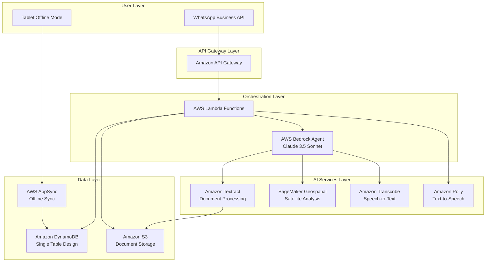

> **Note:** This is a historical spec document representing the original design intent. The implementation evolved beyond this spec — notably using a 5-model APAC inference profile fallback chain (Nova Pro → Nova Lite → Claude 3.7 Sonnet → Claude 3.5 Sonnet v2 → Claude 3 Haiku), multimodal LLM-first document processing with Textract fallback, and a live S3-hosted FPO admin dashboard. See `kisan-setu-mvp/README.md` for current architecture.

# Design Document: Kisan-Setu

## Overview

Kisan-Setu is an AI-powered FPO Operating System built on AWS serverless architecture that transforms how Farmer Producer Organizations operate. The system eliminates traditional barriers to digital adoption by providing a zero-UI, voice-first interface through WhatsApp, combined with advanced AI capabilities for document digitization, satellite-based crop monitoring, and automated credit scoring.

The architecture follows a serverless, event-driven design using AWS managed services to ensure scalability, cost-efficiency, and reliability in low-connectivity rural environments.

### Key Design Principles

1. **Voice-First, Zero-UI**: All interactions optimized for voice input in local languages, no typing required
2. **Offline-First**: System continues operating without connectivity, syncs when available
3. **AI-Native**: Deep integration with AWS Bedrock for intelligent orchestration and reasoning
4. **Cost-Optimized**: Pay-as-you-go model targeting <$50/month per FPO cluster
5. **Serverless**: No infrastructure management, automatic scaling, high availability

## Architecture

### High-Level Architecture



### Component Interaction Flow

**Voice Query Flow:**
1. Farmer sends voice message via WhatsApp
2. API Gateway routes to Lambda function
3. Lambda invokes Transcribe for speech-to-text
4. Bedrock Agent processes intent and orchestrates response
5. Lambda invokes Polly for text-to-speech
6. Response sent back through WhatsApp

**Document Digitization Flow:**
1. User uploads photo via WhatsApp
2. Image stored in S3
3. Lambda triggers Textract Queries
4. Bedrock Agent structures extracted data
5. Structured data stored in DynamoDB
6. Confirmation sent to user

**Satellite Analysis Flow:**
1. User provides GPS coordinates
2. Bedrock Agent invokes SageMaker Geospatial
3. Satellite imagery retrieved and NDVI calculated
4. Yield prediction generated
5. Results stored and sent to user

## Components and Interfaces

### 1. WhatsApp Interface Component

**Responsibilities:**
- Receive messages (text, voice, images) from WhatsApp Business API
- Route messages to appropriate Lambda functions
- Format and send responses back to users
- Handle WhatsApp-specific constraints (message size, format)

**Interfaces:**

```python
class WhatsAppInterface:
    def receive_message(webhook_payload: dict) -> Message:
        """
        Receives webhook payload from WhatsApp Business API
        Returns: Message object with type, content, sender_id, timestamp
        """
        pass
    
    def send_text_response(phone_number: str, text: str, language: str) -> bool:
        """
        Sends text message to WhatsApp user
        Returns: Success status
        """
        pass
    
    def send_voice_response(phone_number: str, audio_url: str) -> bool:
        """
        Sends voice message to WhatsApp user
        Returns: Success status
        """
        pass
    
    def send_document(phone_number: str, document_url: str, caption: str) -> bool:
        """
        Sends document (PDF, Excel) to WhatsApp user
        Returns: Success status
        """
        pass
```

### 2. Voice Agent Component

**Responsibilities:**
- Transcribe voice messages to text
- Detect language and dialect
- Convert text responses to speech
- Handle audio quality issues

**Interfaces:**

```python
class VoiceAgent:
    def transcribe_audio(audio_url: str, language_hint: str = None) -> TranscriptionResult:
        """
        Transcribes audio to text using Amazon Transcribe
        Returns: TranscriptionResult with text, detected_language, confidence
        """
        pass
    
    def synthesize_speech(text: str, language: str, voice_id: str) -> str:
        """
        Converts text to speech using Amazon Polly
        Returns: URL to generated audio file in S3
        """
        pass
    
    def detect_language(audio_url: str) -> str:
        """
        Identifies language from audio
        Returns: Language code (hi-IN, mr-IN, ta-IN)
        """
        pass
```

### 3. Document Processor Component

**Responsibilities:**
- Extract text from handwritten ledger images
- Structure extracted data into JSON format
- Handle multiple vernacular scripts
- Flag low-confidence extractions

**Interfaces:**

```python
class DocumentProcessor:
    def extract_ledger_data(image_url: str, language: str) -> LedgerData:
        """
        Extracts structured data from ledger image using Textract Queries
        Returns: LedgerData with fields (quantity, moisture, price, date, farmer_name)
                 and confidence scores
        """
        pass
    
    def validate_extraction(ledger_data: LedgerData) -> ValidationResult:
        """
        Validates extracted data and flags low-confidence fields
        Returns: ValidationResult with valid fields and fields_needing_review
        """
        pass
    
    def aggregate_ledgers(ledger_list: list[LedgerData]) -> AggregatedData:
        """
        Combines multiple ledger extractions into single dataset
        Returns: AggregatedData with consolidated records
        """
        pass
```

### 4. Satellite Analyzer Component

**Responsibilities:**
- Retrieve satellite imagery for GPS coordinates
- Calculate NDVI values
- Predict crop maturity and yield
- Handle cloud cover and data availability

**Interfaces:**

```python
class SatelliteAnalyzer:
    def get_satellite_imagery(gps_coords: tuple[float, float], 
                             date_range: tuple[date, date]) -> SatelliteImage:
        """
        Retrieves Sentinel-2 imagery for location using SageMaker Geospatial
        Returns: SatelliteImage with bands and metadata
        """
        pass
    
    def calculate_ndvi(satellite_image: SatelliteImage) -> NDVIResult:
        """
        Calculates Normalized Difference Vegetation Index
        Returns: NDVIResult with value, timestamp, confidence
        """
        pass
    
    def predict_yield(ndvi_history: list[NDVIResult], 
                     crop_type: str) -> YieldPrediction:
        """
        Predicts crop yield based on NDVI trends and historical data
        Returns: YieldPrediction with estimated_volume, confidence_interval, 
                 maturity_stage
        """
        pass
```

### 5. Credit Engine Component

**Responsibilities:**
- Calculate farmer reliability scores (0-100)
- Track scoring components (consistency, quality, history, behavior, transparency)
- Generate score breakdowns
- Detect significant score changes

**Interfaces:**

```python
class CreditEngine:
    def calculate_reliability_score(farmer_id: str) -> ReliabilityScore:
        """
        Calculates 0-100 reliability score based on transaction history
        Returns: ReliabilityScore with total_score and component_breakdown
        """
        pass
    
    def calculate_supply_consistency(farmer_id: str) -> float:
        """
        Calculates supply consistency score (0-30 points)
        Based on: delivery frequency, schedule adherence, fulfillment rate
        Returns: Score out of 30
        """
        pass
    
    def calculate_quality_metrics(farmer_id: str) -> float:
        """
        Calculates quality metrics score (0-25 points)
        Based on: moisture levels, grade consistency, rejection rates
        Returns: Score out of 25
        """
        pass
    
    def calculate_transaction_history(farmer_id: str) -> float:
        """
        Calculates transaction history score (0-20 points)
        Based on: volume, relationship length, successful transactions
        Returns: Score out of 20
        """
        pass
    
    def calculate_financial_behavior(farmer_id: str) -> float:
        """
        Calculates financial behavior score (0-15 points)
        Based on: payment patterns, outstanding dues
        Returns: Score out of 15
        """
        pass
    
    def calculate_operational_transparency(farmer_id: str) -> float:
        """
        Calculates operational transparency score (0-10 points)
        Based on: digitization frequency, documentation completeness
        Returns: Score out of 10
        """
        pass
```

### 6. Sync Manager Component

**Responsibilities:**
- Manage offline data storage on tablets
- Detect connectivity changes
- Synchronize offline data to cloud
- Resolve conflicts

**Interfaces:**

```python
class SyncManager:
    def enable_offline_mode() -> bool:
        """
        Switches to offline mode, enables local storage
        Returns: Success status
        """
        pass
    
    def store_offline_transaction(transaction: Transaction) -> str:
        """
        Stores transaction locally with timestamp
        Returns: Local transaction ID
        """
        pass
    
    def detect_connectivity() -> bool:
        """
        Checks for internet connectivity
        Returns: True if connected, False otherwise
        """
        pass
    
    def synchronize_data() -> SyncResult:
        """
        Uploads all offline transactions to cloud via AppSync
        Returns: SyncResult with success_count, failure_count, conflicts
        """
        pass
    
    def resolve_conflict(local_data: Transaction, 
                        cloud_data: Transaction) -> Transaction:
        """
        Resolves conflicts using last-write-wins strategy
        Returns: Resolved transaction
        """
        pass
```

### 7. Bedrock Orchestration Component

**Responsibilities:**
- Understand complex multi-step requests
- Decompose requests into sub-tasks
- Invoke appropriate tools (Textract, SageMaker, Transcribe)
- Maintain conversation context
- Handle errors gracefully

**Interfaces:**

```python
class BedrockOrchestrator:
    def process_request(user_message: str, 
                       conversation_history: list[Message]) -> Response:
        """
        Processes user request using Bedrock Agent with Claude 3.5 Sonnet
        Returns: Response with text, actions_taken, tool_calls
        """
        pass
    
    def decompose_task(complex_request: str) -> list[SubTask]:
        """
        Breaks complex request into ordered sub-tasks
        Returns: List of SubTask objects with dependencies
        """
        pass
    
    def invoke_tool(tool_name: str, parameters: dict) -> ToolResult:
        """
        Invokes external tool (Textract, SageMaker, etc.)
        Returns: ToolResult with data and status
        """
        pass
    
    def maintain_context(conversation_id: str, 
                        new_message: Message) -> ConversationContext:
        """
        Updates and retrieves conversation context
        Returns: ConversationContext with history and state
        """
        pass
```

## Data Models

### Single Table Design (DynamoDB)

The system uses a single-table design pattern for DynamoDB to optimize costs and query performance.

**Table Name:** `KisanSetuData`

**Primary Key Structure:**
- Partition Key (PK): Entity type and ID
- Sort Key (SK): Related entity or timestamp

**Access Patterns:**

```python
# Entity Types and Key Patterns

# 1. FPO
PK: "FPO#{fpo_id}"
SK: "METADATA"
Attributes: {name, location, manager_contact, created_date, member_count}

# 2. Farmer
PK: "FARMER#{farmer_id}"
SK: "METADATA"
Attributes: {name, phone, fpo_id, gps_coords, preferred_language, join_date}

# 3. Transaction
PK: "FARMER#{farmer_id}"
SK: "TXN#{timestamp}"
Attributes: {quantity, moisture, price, crop_type, quality_grade, ledger_image_url}

# 4. Reliability Score
PK: "FARMER#{farmer_id}"
SK: "SCORE#{date}"
Attributes: {total_score, supply_consistency, quality_metrics, 
             transaction_history, financial_behavior, operational_transparency}

# 5. Satellite Analysis
PK: "FIELD#{gps_coords_hash}"
SK: "NDVI#{timestamp}"
Attributes: {ndvi_value, satellite_image_url, crop_type, predicted_yield, 
             confidence, maturity_stage}

# 6. Conversation History
PK: "CONVERSATION#{farmer_id}"
SK: "MSG#{timestamp}"
Attributes: {message_text, message_type, language, response_text, tool_calls}

# 7. Offline Sync Queue
PK: "SYNC#{device_id}"
SK: "PENDING#{timestamp}"
Attributes: {transaction_data, sync_status, retry_count}
```

**Global Secondary Indexes (GSI):**

```python
# GSI-1: Query farmers by FPO
PK: fpo_id
SK: farmer_id

# GSI-2: Query transactions by date range
PK: fpo_id
SK: timestamp

# GSI-3: Query pending sync items
PK: sync_status
SK: timestamp
```

### Data Structures

```python
@dataclass
class Message:
    message_id: str
    sender_id: str
    message_type: str  # 'text', 'voice', 'image'
    content: str  # text or URL
    timestamp: datetime
    language: str

@dataclass
class LedgerData:
    ledger_id: str
    farmer_id: str
    quantity: float
    moisture: float
    price: float
    date: date
    crop_type: str
    confidence_scores: dict[str, float]
    image_url: str
    fields_needing_review: list[str]

@dataclass
class NDVIResult:
    field_id: str
    gps_coords: tuple[float, float]
    ndvi_value: float
    timestamp: datetime
    confidence: float
    satellite_image_url: str

@dataclass
class YieldPrediction:
    field_id: str
    estimated_volume: float
    confidence_interval: tuple[float, float]
    maturity_stage: str  # 'early', 'mid', 'late', 'harvest_ready'
    prediction_date: datetime

@dataclass
class ReliabilityScore:
    farmer_id: str
    total_score: float  # 0-100
    supply_consistency: float  # 0-30
    quality_metrics: float  # 0-25
    transaction_history: float  # 0-20
    financial_behavior: float  # 0-15
    operational_transparency: float  # 0-10
    calculation_date: datetime
    score_change: float  # change from previous score

@dataclass
class Transaction:
    transaction_id: str
    farmer_id: str
    fpo_id: str
    quantity: float
    crop_type: str
    quality_grade: str
    moisture: float
    price: float
    timestamp: datetime
    ledger_image_url: str
    sync_status: str  # 'synced', 'pending', 'conflict'
```

## Correctness Properties


*A property is a characteristic or behavior that should hold true across all valid executions of a system—essentially, a formal statement about what the system should do. Properties serve as the bridge between human-readable specifications and machine-verifiable correctness guarantees.*

### Property Reflection

After analyzing all acceptance criteria, I identified the following redundancies and consolidations:

**Redundancy Analysis:**
- Requirements 5.2-5.6 (individual credit score components) can be consolidated with 5.1 into a single comprehensive property about score composition
- Requirements 5.7 is subsumed by the consolidated credit scoring property (breakdown is part of score calculation)
- Requirements 2.2 and 2.4 overlap significantly (both test structured output format) and can be combined
- Requirements 6.1 and 6.4 both test message routing and can be consolidated

**Consolidated Properties:**
After reflection, the following properties provide unique validation value without redundancy.

### Voice Interface Properties

**Property 1: Language-Consistent Transcription**
*For any* voice message in Hindi, Marathi, or Tamil, transcribing the audio should produce text in the same language as the spoken input, with the detected language correctly identified.
**Validates: Requirements 1.1, 1.2**

**Property 2: Text-to-Speech Language Matching**
*For any* text response in a supported language (Hindi, Marathi, Tamil), synthesizing speech should produce audio in the same language as the input text.
**Validates: Requirements 1.4**

### Document Processing Properties

**Property 3: Structured Ledger Extraction**
*For any* ledger image extraction, the output should be valid JSON containing all required fields (quantity, moisture, price, date, farmer_name) with their corresponding confidence scores.
**Validates: Requirements 2.2, 2.4**

**Property 4: Multi-Script OCR Support**
*For any* handwritten document in Hindi, Marathi, or Tamil scripts, the Document_Processor should successfully extract text with recognizable characters from the correct script.
**Validates: Requirements 2.3**

**Property 5: Low-Confidence Field Flagging**
*For any* extracted field with confidence score below threshold (e.g., 0.7), the field should be included in the fields_needing_review list and flagged for manual verification.
**Validates: Requirements 2.5**

**Property 6: Ledger Aggregation Completeness**
*For any* list of ledger extractions from the same farmer, aggregating them should produce a dataset where the total record count equals the sum of records from all individual ledgers.
**Validates: Requirements 2.6**

### Satellite Analysis Properties

**Property 7: GPS-Based Imagery Retrieval**
*For any* valid GPS coordinates (latitude between -90 and 90, longitude between -180 and 180), the Satellite_Analyzer should successfully retrieve satellite imagery or return a clear unavailability message.
**Validates: Requirements 3.1**

**Property 8: NDVI Value Range Validity**
*For any* satellite image with vegetation bands, the calculated NDVI value should be within the valid range of -1.0 to 1.0.
**Validates: Requirements 3.2**

**Property 9: Maturity Stage Classification**
*For any* NDVI calculation, the predicted crop maturity stage should be one of the valid stages: 'early', 'mid', 'late', or 'harvest_ready'.
**Validates: Requirements 3.3**

**Property 10: Yield Prediction Completeness**
*For any* yield prediction, the result should include an estimated volume, confidence interval where lower_bound <= estimate <= upper_bound, and a maturity stage.
**Validates: Requirements 3.4, 3.6**

### Offline Sync Properties

**Property 11: Offline Transaction Persistence**
*For any* transaction entered in offline mode, the transaction should be stored locally with a timestamp and retrievable until synchronization occurs.
**Validates: Requirements 4.2**

**Property 12: Chronological Sync Ordering**
*For any* set of offline transactions, when synchronized to the cloud, they should be uploaded in chronological order based on their timestamps (earliest first).
**Validates: Requirements 4.4**

**Property 13: Last-Write-Wins Conflict Resolution**
*For any* pair of conflicting transactions (same transaction_id, different data), the conflict resolution should select the transaction with the most recent timestamp and log the conflict.
**Validates: Requirements 4.5**

**Property 14: Sync Completion Notification**
*For any* synchronization operation (successful or failed), a notification should be generated with sync status including success_count and failure_count.
**Validates: Requirements 4.6**

### Credit Scoring Properties

**Property 15: Reliability Score Composition**
*For any* farmer with transaction history, the calculated reliability score should:
- Be between 0 and 100 (inclusive)
- Equal the sum of: supply_consistency (0-30) + quality_metrics (0-25) + transaction_history (0-20) + financial_behavior (0-15) + operational_transparency (0-10)
- Include a breakdown showing each component's contribution
**Validates: Requirements 5.1, 5.2, 5.3, 5.4, 5.5, 5.6, 5.7**

**Property 16: Significant Score Change Notification**
*For any* farmer whose reliability score changes by more than 10 points between calculations, a notification should be sent to the FPO manager including the score delta and contributing factors.
**Validates: Requirements 5.8**

### WhatsApp Interface Properties

**Property 17: Message Type Routing**
*For any* incoming WhatsApp message, the message should be routed to the correct component based on its type: text messages to Bedrock Orchestrator, voice messages to Voice_Agent, images to Document_Processor.
**Validates: Requirements 6.1, 6.4**

**Property 18: Structured Data Formatting**
*For any* structured data (tables, lists, JSON objects) sent via WhatsApp, the formatted output should be plain text without special characters that break WhatsApp rendering.
**Validates: Requirements 6.5**

### Orchestration Properties

**Property 19: Tool Invocation Correctness**
*For any* request requiring external data (document extraction, satellite analysis, transcription), the appropriate tool should be invoked with correct parameters based on the request type.
**Validates: Requirements 7.2**

**Property 20: Mathematical Calculation Accuracy**
*For any* arithmetic operation (addition, subtraction, multiplication, division, percentage), the calculated result should match the mathematically correct value within floating-point precision limits.
**Validates: Requirements 7.3**

**Property 21: Conversation Context Persistence**
*For any* message added to a conversation, retrieving the conversation history should include that message with its original content, timestamp, and metadata.
**Validates: Requirements 7.4**

### Data Storage Properties

**Property 22: DynamoDB Key Structure Compliance**
*For any* data entity stored in DynamoDB, the partition key (PK) and sort key (SK) should follow the defined format for that entity type (e.g., "FARMER#{id}" for PK, "METADATA" or "TXN#{timestamp}" for SK).
**Validates: Requirements 8.1**

**Property 23: Referential Integrity Maintenance**
*For any* transaction stored in the system, the referenced farmer_id and fpo_id should correspond to existing Farmer and FPO entities in the database.
**Validates: Requirements 8.3**

**Property 24: Audit Trail Creation**
*For any* data update operation (create, modify, delete), an audit record should be created containing the operation type, timestamp, user identifier, and changed fields.
**Validates: Requirements 8.4**

**Property 25: Date Range Query Correctness**
*For any* query with date range filters [start_date, end_date], all returned records should have timestamps within that range (inclusive).
**Validates: Requirements 8.5**

**Property 26: Sensitive Data Encryption**
*For any* data entity containing sensitive fields (price, financial_behavior, phone numbers), those fields should be encrypted at rest in DynamoDB.
**Validates: Requirements 8.6**

### Cost Optimization Properties

**Property 27: Request Batching Efficiency**
*For any* set of similar AI inference requests arriving within a batching window (e.g., 100ms), the requests should be combined into a single batch call when the service supports batching.
**Validates: Requirements 9.4**

**Property 28: Satellite Data Caching**
*For any* satellite imagery request for a specific location and date, if a request for the same location and date was made within the cache TTL (e.g., 24 hours), the cached result should be returned instead of making a new API call.
**Validates: Requirements 9.5**

### Error Handling Properties

**Property 29: Exponential Backoff Retry Logic**
*For any* failed external service call, the system should retry up to 3 times with exponentially increasing delays (e.g., 1s, 2s, 4s) before giving up.
**Validates: Requirements 10.1**

**Property 30: Localized Error Messages**
*For any* error after retry exhaustion, the system should return an error message in the user's preferred language (Hindi, Marathi, or Tamil) and log the technical error details.
**Validates: Requirements 10.2**

**Property 31: Batch Processing Resilience**
*For any* batch of documents being processed, if one document fails, the remaining documents should continue processing and the results should include both successful extractions and failed document IDs.
**Validates: Requirements 10.3**

**Property 32: Critical Error Alerting**
*For any* error classified as critical (system failure, data corruption, security breach), an alert should be sent to administrators within 60 seconds containing error type, timestamp, and context.
**Validates: Requirements 10.5**

## Error Handling

### Error Categories

**1. User Input Errors**
- Invalid GPS coordinates
- Unsupported file formats
- Audio quality too poor to transcribe
- Empty or malformed messages

**Handling Strategy:**
- Return user-friendly error message in their language
- Suggest corrective action
- Do not retry automatically
- Log for analytics

**2. External Service Errors**
- Textract API failures
- SageMaker timeout
- Transcribe service unavailable
- WhatsApp API rate limits

**Handling Strategy:**
- Retry up to 3 times with exponential backoff (1s, 2s, 4s)
- If all retries fail, return graceful error message
- Log error with full context
- Alert administrators for repeated failures

**3. Data Errors**
- Missing required fields
- Referential integrity violations
- Sync conflicts
- Low confidence extractions

**Handling Strategy:**
- Flag for manual review
- Continue processing other items
- Notify relevant users
- Maintain data consistency

**4. System Errors**
- Lambda timeout
- DynamoDB throttling
- Out of memory
- Unexpected exceptions

**Handling Strategy:**
- Log full stack trace
- Send critical alerts
- Return generic error to user
- Implement circuit breakers for cascading failures

### Error Response Format

```python
@dataclass
class ErrorResponse:
    error_code: str  # e.g., "INVALID_GPS", "SERVICE_UNAVAILABLE"
    user_message: str  # Localized, user-friendly message
    technical_details: str  # For logging and debugging
    suggested_action: str  # What user should do next
    retry_after: int  # Seconds to wait before retry (if applicable)
    timestamp: datetime
```

### Circuit Breaker Pattern

For external services, implement circuit breaker to prevent cascading failures:

```python
class CircuitBreaker:
    states = ['CLOSED', 'OPEN', 'HALF_OPEN']
    
    # CLOSED: Normal operation, requests pass through
    # OPEN: Too many failures, reject requests immediately
    # HALF_OPEN: Testing if service recovered, allow limited requests
    
    failure_threshold = 5  # Open circuit after 5 failures
    timeout = 60  # Keep circuit open for 60 seconds
    success_threshold = 2  # Close circuit after 2 successes in HALF_OPEN
```

## Testing Strategy

### Dual Testing Approach

The system requires both unit tests and property-based tests for comprehensive coverage:

**Unit Tests:**
- Specific examples demonstrating correct behavior
- Edge cases (empty inputs, boundary values, malformed data)
- Error conditions and exception handling
- Integration points between components
- Mock external services (Textract, SageMaker, Transcribe)

**Property-Based Tests:**
- Universal properties that hold for all inputs
- Randomized input generation for comprehensive coverage
- Minimum 100 iterations per property test
- Each test tagged with feature name and property number

### Property-Based Testing Configuration

**Framework:** Use `hypothesis` for Python or `fast-check` for TypeScript/JavaScript

**Configuration:**
```python
# Minimum 100 iterations per property test
@given(strategies.farmer_data())
@settings(max_examples=100)
def test_property_15_reliability_score_composition(farmer_data):
    """
    Feature: kisan-setu, Property 15: Reliability Score Composition
    For any farmer with transaction history, the calculated reliability score should
    be between 0 and 100 and equal the sum of all components.
    """
    score = credit_engine.calculate_reliability_score(farmer_data.farmer_id)
    
    # Score bounds
    assert 0 <= score.total_score <= 100
    
    # Component bounds
    assert 0 <= score.supply_consistency <= 30
    assert 0 <= score.quality_metrics <= 25
    assert 0 <= score.transaction_history <= 20
    assert 0 <= score.financial_behavior <= 15
    assert 0 <= score.operational_transparency <= 10
    
    # Composition property
    expected_total = (score.supply_consistency + score.quality_metrics + 
                     score.transaction_history + score.financial_behavior + 
                     score.operational_transparency)
    assert abs(score.total_score - expected_total) < 0.01  # floating point tolerance
```

### Test Data Generators

Property-based tests require generators for domain-specific data:

```python
from hypothesis import strategies as st

# Farmer data generator
@st.composite
def farmer_data(draw):
    return FarmerData(
        farmer_id=draw(st.uuids()),
        name=draw(st.text(min_size=1, max_size=50)),
        phone=draw(st.from_regex(r'\+91[0-9]{10}')),
        fpo_id=draw(st.uuids()),
        gps_coords=(
            draw(st.floats(min_value=-90, max_value=90)),  # latitude
            draw(st.floats(min_value=-180, max_value=180))  # longitude
        ),
        preferred_language=draw(st.sampled_from(['hi-IN', 'mr-IN', 'ta-IN']))
    )

# Transaction data generator
@st.composite
def transaction_data(draw):
    return Transaction(
        transaction_id=draw(st.uuids()),
        farmer_id=draw(st.uuids()),
        fpo_id=draw(st.uuids()),
        quantity=draw(st.floats(min_value=0.1, max_value=10000)),
        crop_type=draw(st.sampled_from(['onion', 'wheat', 'rice', 'cotton'])),
        quality_grade=draw(st.sampled_from(['A', 'B', 'C'])),
        moisture=draw(st.floats(min_value=0, max_value=100)),
        price=draw(st.floats(min_value=1, max_value=100000)),
        timestamp=draw(st.datetimes()),
        sync_status=draw(st.sampled_from(['synced', 'pending', 'conflict']))
    )

# NDVI result generator
@st.composite
def ndvi_result(draw):
    return NDVIResult(
        field_id=draw(st.uuids()),
        gps_coords=(
            draw(st.floats(min_value=-90, max_value=90)),
            draw(st.floats(min_value=-180, max_value=180))
        ),
        ndvi_value=draw(st.floats(min_value=-1.0, max_value=1.0)),
        timestamp=draw(st.datetimes()),
        confidence=draw(st.floats(min_value=0.0, max_value=1.0)),
        satellite_image_url=draw(st.from_regex(r'https://.*\.tif'))
    )
```

### Test Coverage Goals

- **Unit Test Coverage:** Minimum 80% code coverage
- **Property Test Coverage:** All 32 correctness properties implemented
- **Integration Test Coverage:** All component interfaces tested
- **Edge Case Coverage:** All identified edge cases from prework tested

### Testing Pyramid

```
            / \
           /   \
          /     \  E2E Tests (5%)
         /       \  - WhatsApp integration
        /---------\  - Full workflow tests
       /           \
      / Integration \ (15%)
     /   Tests       \  - Component interactions
    /-----------------\  - External service mocks
   /                   \
  /   Unit + Property   \ (80%)
 /      Tests            \  - Individual functions
/_________________________\  - Correctness properties
```

### Continuous Testing

- Run unit tests on every commit
- Run property tests on every pull request
- Run integration tests nightly
- Run E2E tests before deployment
- Monitor property test failures for regression detection

### Test Environment Setup

**Mock Services:**
- Mock WhatsApp Business API for message sending/receiving
- Mock AWS Textract with pre-generated extraction results
- Mock SageMaker Geospatial with sample satellite imagery
- Mock Amazon Transcribe/Polly with sample audio files

**Test Data:**
- Sample handwritten ledger images in Hindi, Marathi, Tamil
- Sample voice recordings in multiple dialects
- Sample satellite imagery with known NDVI values
- Sample farmer transaction histories with known credit scores

**Infrastructure:**
- Use LocalStack for local AWS service emulation
- Use DynamoDB Local for database testing
- Use pytest fixtures for test data setup/teardown
- Use GitHub Actions for CI/CD pipeline
