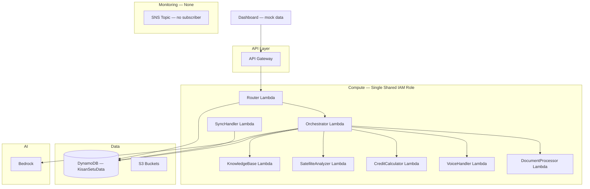
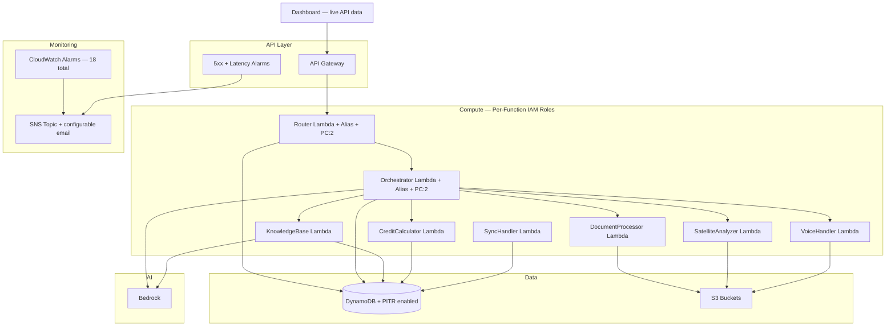

# Design Document: Production Readiness (Phase 6)

## Overview

This design covers the Phase 6 production readiness hardening for the Kisan Setu MVP — an AI-powered agricultural advisory platform for Indian farmers via WhatsApp. The system runs on AWS (CDK Python) with 8 Lambda functions, DynamoDB single-table design, API Gateway, AppSync, and Bedrock AI.

Phase 6 addresses 11 requirements spanning operational monitoring (CloudWatch alarms, SNS alerts), security (per-function IAM roles), data durability (PITR), performance (provisioned concurrency), live dashboard integration, dead code removal (Redis, Bedrock Agent env vars), code quality (module-level imports, idempotent seeding), and documentation updates.

All changes target existing files — no new services are introduced. The CDK stack (`infrastructure_stack.py`) receives the bulk of infrastructure changes, while `dashboard/app.js`, `cost_optimization.py`, `satellite_mock.py`, and `seed_data.py` receive targeted code fixes.

## Architecture

### Current State



### Target State



### Key Architectural Decisions

1. **Per-function IAM roles**: Each Lambda gets its own role scoped to only the AWS services it actually calls. This limits blast radius if any single function is compromised. The shared `lambda_role` is removed entirely.

2. **CloudWatch alarms via CDK loops**: Rather than 18 hand-written alarm constructs, we loop over the 8 Lambda function references and create Errors + Throttles alarms per function, plus 2 API Gateway alarms (5xx, p99 latency). All alarms notify the existing `alert_topic`.

3. **CDK context for SNS email**: The `alert_email` parameter uses `self.node.try_get_context('alert_email')` so it's optional at deploy time (`cdk deploy -c alert_email=ops@example.com`). No code change needed to add/change subscribers.

4. **PITR via AwsCustomResource**: Since the DynamoDB table is imported via `from_table_name`, we can't set PITR declaratively. We use `cr.AwsCustomResource` with `UpdateContinuousBackups` SDK call. A manual CLI fallback is documented.

5. **Provisioned concurrency via Version + Alias**: CDK requires publishing a version and creating an alias to attach provisioned concurrency. The API Gateway integration must point to the alias ARN, not `$LATEST`.

6. **Dashboard polling pattern**: The dashboard switches from hardcoded mock arrays to `fetch()` calls with `x-api-key` header, 5-second `setInterval` polling, and error/retry UI. No WebSocket needed for MVP.

7. **In-memory-only CacheManager**: Redis code is dead (never deployed). We strip all Redis imports, env vars, and branches. The in-memory dict with TTL expiry remains as the sole cache.

8. **Idempotent seed via conditional writes**: Each `put_item` gets `ConditionExpression='attribute_not_exists(PK)'` with a try/except for `ConditionalCheckFailedException` to skip existing items.

## Components and Interfaces

### Component 1: CloudWatch Alarms (Requirement 1)

**File**: `kisan-setu-mvp/infrastructure_stack.py`

**Implementation**: Add a helper method or inline loop after all Lambda definitions that creates alarms:

```python
import aws_cdk.aws_cloudwatch as cloudwatch
import aws_cdk.aws_cloudwatch_actions as cw_actions

# Lambda error + throttle alarms
lambda_functions = {
    "Router": router_lambda,
    "Orchestrator": orchestrator_lambda,
    "DocumentProcessor": processor_lambda,
    "VoiceHandler": voice_lambda,
    "CreditCalculator": credit_lambda,
    "SatelliteAnalyzer": satellite_lambda,
    "KnowledgeBase": knowledge_lambda,
    "SyncHandler": sync_lambda,
}

for name, fn in lambda_functions.items():
    cloudwatch.Alarm(self, f"{name}ErrorAlarm",
        metric=fn.metric_errors(period=Duration.minutes(5)),
        threshold=0,
        comparison_operator=cloudwatch.ComparisonOperator.GREATER_THAN_THRESHOLD,
        evaluation_periods=1,
        alarm_name=f"kisan-setu-{name}-errors",
    ).add_alarm_action(cw_actions.SnsAction(alert_topic))

    cloudwatch.Alarm(self, f"{name}ThrottleAlarm",
        metric=fn.metric_throttles(period=Duration.minutes(5)),
        threshold=0,
        comparison_operator=cloudwatch.ComparisonOperator.GREATER_THAN_THRESHOLD,
        evaluation_periods=1,
        alarm_name=f"kisan-setu-{name}-throttles",
    ).add_alarm_action(cw_actions.SnsAction(alert_topic))

# API Gateway 5xx alarm
cloudwatch.Alarm(self, "ApiGateway5xxAlarm",
    metric=api.metric_server_error(period=Duration.minutes(5)),
    threshold=0,
    comparison_operator=cloudwatch.ComparisonOperator.GREATER_THAN_THRESHOLD,
    evaluation_periods=1,
    alarm_name="kisan-setu-api-5xx",
).add_alarm_action(cw_actions.SnsAction(alert_topic))

# API Gateway p99 latency alarm
cloudwatch.Alarm(self, "ApiGatewayLatencyAlarm",
    metric=api.metric_latency(period=Duration.minutes(5), statistic="p99"),
    threshold=10000,
    comparison_operator=cloudwatch.ComparisonOperator.GREATER_THAN_THRESHOLD,
    evaluation_periods=1,
    alarm_name="kisan-setu-api-latency-p99",
).add_alarm_action(cw_actions.SnsAction(alert_topic))
```

**Total alarms**: 8×2 (Lambda) + 2 (API Gateway) = 18 alarms.

### Component 2: SNS Alert Email via CDK Context (Requirement 2)

**File**: `kisan-setu-mvp/infrastructure_stack.py`

**Implementation**: After `alert_topic` creation, replace the commented-out email subscription:

```python
alert_email = self.node.try_get_context('alert_email')
if alert_email:
    alert_topic.add_subscription(
        sns_subscriptions.EmailSubscription(alert_email)
    )
```

**Usage**: `cdk deploy -c alert_email=ops@example.com`

### Component 3: DynamoDB PITR via AwsCustomResource (Requirement 3)

**File**: `kisan-setu-mvp/infrastructure_stack.py`

**Implementation**: Since the table is imported via `from_table_name`, we use `AwsCustomResource` to call the `UpdateContinuousBackups` API:

```python
from aws_cdk import custom_resources as cr

cr.AwsCustomResource(self, "EnablePITR",
    on_create=cr.AwsSdkCall(
        service="DynamoDB",
        action="updateContinuousBackups",
        parameters={
            "TableName": "KisanSetuData",
            "PointInTimeRecoverySpecification": {
                "PointInTimeRecoveryEnabled": True
            }
        },
        physical_resource_id=cr.PhysicalResourceId.of("KisanSetuData-PITR"),
    ),
    policy=cr.AwsCustomResourcePolicy.from_statements([
        iam.PolicyStatement(
            actions=["dynamodb:UpdateContinuousBackups", "dynamodb:DescribeContinuousBackups"],
            resources=[f"arn:aws:dynamodb:{region}:{account_id}:table/KisanSetuData"]
        )
    ])
)
```

**Manual fallback CLI**:
```bash
aws dynamodb update-continuous-backups \
  --table-name KisanSetuData \
  --point-in-time-recovery-specification PointInTimeRecoveryEnabled=true
```

### Component 4: Provisioned Concurrency (Requirement 4)

**File**: `kisan-setu-mvp/infrastructure_stack.py`

**Implementation**: For Router and Orchestrator, publish a version, create an alias with provisioned concurrency, and update API Gateway to use the alias:

```python
# Router
router_version = router_lambda.current_version
router_alias = lambda_.Alias(self, "RouterAlias",
    alias_name="live",
    version=router_version,
    provisioned_concurrent_executions=2,
)

# Orchestrator
orchestrator_version = orchestrator_lambda.current_version
orchestrator_alias = lambda_.Alias(self, "OrchestratorAlias",
    alias_name="live",
    version=orchestrator_version,
    provisioned_concurrent_executions=2,
)
```

The API Gateway `/webhook` integration must use `router_alias` instead of `router_lambda`:

```python
webhook.add_method("POST", apigw.LambdaIntegration(router_alias))
webhook.add_method("GET", apigw.LambdaIntegration(router_alias))
```

### Component 5: Dashboard Live API Integration (Requirement 5)

**File**: `kisan-setu-mvp/dashboard/app.js`

**Changes**:
1. Replace `mockFarmers` array in `initSatelliteMap()` with a `fetchFarmers()` call
2. Replace mock `dates`/`scores` in `initCreditChart()` with a `fetchCreditScores()` call
3. Replace `addDemoMessages()` in `fetchMessages()` with a real API fetch
4. Add `x-api-key` header to all fetch calls
5. Add error handling with retry after 5 seconds
6. Remove the `setInterval` that generates random demo messages
7. Keep the 5-second polling interval for `fetchMessages()`

```javascript
const API_KEY = ''; // Set after deployment

async function apiFetch(path) {
    const response = await fetch(`${API_GATEWAY}${path}`, {
        headers: { 'x-api-key': API_KEY }
    });
    if (!response.ok) throw new Error(`API error: ${response.status}`);
    return response.json();
}

async function fetchWithRetry(path, retryDelay = 5000) {
    try {
        return await apiFetch(path);
    } catch (error) {
        console.error(`Fetch failed for ${path}:`, error);
        showError(`Failed to load data from ${path}`);
        setTimeout(() => fetchWithRetry(path, retryDelay), retryDelay);
        return null;
    }
}
```

### Component 6: CacheManager Redis Removal (Requirement 6)

**File**: `kisan-setu-mvp/lambda/common/cost_optimization.py`

**Changes**:
1. Remove `import redis` try/except block and `REDIS_AVAILABLE` flag
2. Remove `REDIS_ENDPOINT` and `REDIS_PORT` env var reads
3. Remove `self.redis_client` initialization and Redis connection logic from `__init__`
4. Remove Redis branches from `get()`, `set()`, `delete()` — keep only in-memory dict logic
5. Update module docstring to state "in-memory caching only"
6. Remove `redis_endpoint` and `redis_port` parameters from `__init__` signature

The `CacheManager.__init__` simplifies to:
```python
def __init__(self, ttl_seconds: int = CACHE_TTL_SECONDS):
    self.ttl_seconds = ttl_seconds
    self.in_memory_cache = {}
```

### Component 7: Per-Function IAM Roles (Requirement 7)

**File**: `kisan-setu-mvp/infrastructure_stack.py`

**Implementation**: Replace the single shared `lambda_role` with 8 individual roles. Each role gets `AWSLambdaBasicExecutionRole` plus only the specific permissions that function needs.

**Permission matrix**:

| Lambda | DynamoDB | S3 | Lambda:Invoke | Bedrock | Textract | Transcribe | Polly | SageMaker Geo | SecretsManager | SNS | KMS | OpenSearch |
|--------|----------|-----|---------------|---------|----------|------------|-------|---------------|----------------|-----|-----|------------|
| Router | R/W | R/W | ✓ | — | — | — | — | — | ✓ | ✓ | ✓ | — |
| Orchestrator | R/W | R | ✓ | Invoke/Converse | — | — | — | — | ✓ | ✓ | ✓ | — |
| DocumentProcessor | R/W | R/W | — | — | ✓ | — | — | — | ✓ | ✓ | ✓ | — |
| VoiceHandler | R/W | R/W | ✓ | — | — | ✓ | ✓ | — | ✓ | ✓ | ✓ | — |
| CreditCalculator | R/W | — | — | — | — | — | — | — | — | ✓ | ✓ | — |
| SatelliteAnalyzer | R/W | R/W | — | — | — | — | — | ✓ | — | ✓ | ✓ | — |
| KnowledgeBase | R/W | — | — | Retrieve/Invoke | — | — | — | — | — | ✓ | ✓ | ✓ |
| SyncHandler | R/W | — | — | — | — | — | — | — | — | ✓ | ✓ | — |

**DynamoDB scoping**: Use `table.table_arn` and `f"{table.table_arn}/index/*"` instead of `AmazonDynamoDBFullAccess`.

**S3 scoping**: Use specific bucket ARNs (`raw_bucket.bucket_arn`, etc.) instead of `AmazonS3FullAccess`.

**Helper function** to reduce boilerplate:
```python
def _create_lambda_role(self, name, extra_policies=None):
    role = iam.Role(self, f"{name}Role",
        assumed_by=iam.ServicePrincipal("lambda.amazonaws.com"),
        managed_policies=[
            iam.ManagedPolicy.from_aws_managed_policy_name(
                "service-role/AWSLambdaBasicExecutionRole"
            )
        ]
    )
    for policy in (extra_policies or []):
        role.add_to_policy(policy)
    return role
```

### Component 8: Remove Bedrock Agent Env Vars (Requirement 8)

**File**: `kisan-setu-mvp/infrastructure_stack.py`

**Status**: Verified — `BEDROCK_AGENT_ID` and `BEDROCK_AGENT_ALIAS_ID` are NOT present in the CDK stack. They were already removed in a prior phase. The env vars only exist in test files (`test_orchestrator.py`, `test_bug_lambda_function_name_fix.py`).

**Action**: Update the test files to remove references to these env vars, since they are no longer set by the stack. No CDK changes needed.

### Component 9: Module-Level Imports in Satellite Mock (Requirement 9)

**File**: `kisan-setu-mvp/lambda/satellite/satellite_mock.py`

**Changes**: Move `numpy`, `PIL`, `boto3`, and `io` imports from inside `generate_mock_heatmap_url()` to module level:

```python
import io
import os
import boto3

try:
    import numpy as np
    from PIL import Image, ImageDraw
    IMAGING_AVAILABLE = True
except ImportError:
    np = None
    Image = None
    ImageDraw = None
    IMAGING_AVAILABLE = False
```

Update `generate_mock_heatmap_url()` to check the flag:
```python
def generate_mock_heatmap_url(self, latitude, longitude, crop_type="Onion"):
    if not IMAGING_AVAILABLE:
        import logging
        logging.warning("numpy/PIL not available — cannot generate heatmap")
        return None
    # ... rest of method unchanged
```

### Component 10: Idempotent Seed Script (Requirement 10)

**File**: `kisan-setu-mvp/seed_data.py`

**Changes**: Wrap each `put_item` with a conditional write and exception handling:

```python
from botocore.exceptions import ClientError

def _put_item_idempotent(item):
    """Put item only if PK doesn't already exist. Returns True if created, False if skipped."""
    try:
        table.put_item(
            Item=item,
            ConditionExpression='attribute_not_exists(PK)'
        )
        return True
    except ClientError as e:
        if e.response['Error']['Code'] == 'ConditionalCheckFailedException':
            return False
        raise
```

Each seed function tracks created/skipped counts and the `main()` function prints a summary:
```
Seed complete! Created: 42, Skipped: 12
```

### Component 11: Documentation Updates (Requirement 11)

**Files**: All root-level markdown files.

| File | Update |
|------|--------|
| `personal_go_to_task.md` | Mark all Phase 6 items as ✅, move Informational items to completed |
| `README.md` | Add Phase 6 capabilities (alarms, IAM, PC, PITR, live dashboard) |
| `architecture.md` | Document per-function IAM, CloudWatch alarms, provisioned concurrency |
| `IMPLEMENTATION_STATUS_AND_TASKS.md` | Add Phase 6 section with all completed tasks |
| `BENCHMARK_REPORT.md` | Add Phase 6 audit results |
| `FAQ.md` | Add Q&A for new production readiness features |
| `TROUBLESHOOTING.md` | Add entries for CloudWatch alarms, provisioned concurrency, PITR |
| `kisan-setu-mvp/README.md` | Reflect production readiness changes |

## Data Models

### CloudWatch Alarm Configuration Model

Each alarm follows this pattern:
- **Metric**: Lambda Errors/Throttles or API Gateway 5XXError/Latency
- **Period**: 5 minutes
- **Threshold**: 0 (errors/throttles/5xx) or 10000ms (latency p99)
- **Evaluation Periods**: 1
- **Action**: SNS notification to `alert_topic`
- **Naming**: `kisan-setu-{FunctionName}-{metric}` or `kisan-setu-api-{metric}`

### IAM Role Model

Each per-function role follows this structure:
```
Role: KisanSetu-{FunctionName}-Role
├── ManagedPolicy: AWSLambdaBasicExecutionRole
├── InlinePolicy: DynamoDB (scoped to table ARN)
├── InlinePolicy: S3 (scoped to bucket ARNs, if needed)
├── InlinePolicy: SNS Publish (scoped to alert_topic ARN)
├── InlinePolicy: KMS (scoped to encryption_key ARN)
└── InlinePolicy: Function-specific (Bedrock, Textract, etc.)
```

### Provisioned Concurrency Model

```
Lambda Function
├── Version (auto-published via current_version)
└── Alias "live"
    └── ProvisionedConcurrentExecutions: 2
```

API Gateway integration points to `alias.function_arn` instead of `function.function_arn`.

### Dashboard API Data Models

**Farmer/NDVI endpoint response** (from DynamoDB scan/query):
```json
{
  "farmers": [
    {
      "name": "string",
      "lat": "number",
      "lon": "number",
      "ndvi": "number",
      "crop": "string"
    }
  ]
}
```

**Credit score endpoint response**:
```json
{
  "scores": [
    { "date": "string", "score": "number" }
  ]
}
```

**Messages endpoint response**:
```json
{
  "messages": [
    {
      "sender": "string",
      "name": "string",
      "type": "string",
      "content": "string",
      "language": "string",
      "time": "string"
    }
  ]
}
```

### Seed Data Idempotency Model

Each `put_item` call uses:
```
ConditionExpression: attribute_not_exists(PK)
```

On `ConditionalCheckFailedException`: log skip, increment skip counter, continue.

Summary output: `Created: N, Skipped: M`

## Correctness Properties

*A property is a characteristic or behavior that should hold true across all valid executions of a system — essentially, a formal statement about what the system should do. Properties serve as the bridge between human-readable specifications and machine-verifiable correctness guarantees.*

### Property 1: Lambda alarm completeness

*For any* Lambda function defined in the CDK stack, the synthesized CloudFormation template SHALL contain both an Errors alarm and a Throttles alarm, each with threshold 0, period 300 seconds, evaluation periods 1, and an SNS alarm action targeting the alert topic ARN.

**Validates: Requirements 1.1, 1.2, 1.4**

### Property 2: Per-function IAM role isolation

*For any* Lambda function defined in the CDK stack, the synthesized CloudFormation template SHALL assign a unique IAM role (distinct from all other Lambda roles) that includes the `AWSLambdaBasicExecutionRole` managed policy.

**Validates: Requirements 7.1, 7.2**

### Property 3: IAM resource scoping — no wildcard DynamoDB or S3

*For any* IAM policy statement in the synthesized CloudFormation template that grants DynamoDB or S3 actions, the resource ARN SHALL be scoped to specific table/bucket ARNs (not `*` or `arn:aws:dynamodb:*:*:*`).

**Validates: Requirements 7.12, 7.13**

### Property 4: CacheManager in-memory round trip

*For any* string key and string value, calling `CacheManager.set(key, value)` followed by `CacheManager.get(key)` before the TTL expires SHALL return the original value. Calling `CacheManager.get(key)` after the TTL expires SHALL return None.

**Validates: Requirements 6.5**

### Property 5: Seed script idempotent writes

*For any* item written by the seed script, the `put_item` call SHALL include `ConditionExpression='attribute_not_exists(PK)'`. When the same seed function is called twice with the same data, the second call SHALL not overwrite the first item and SHALL not raise an error.

**Validates: Requirements 10.1, 10.2**

## Error Handling

### CDK Stack Errors

| Scenario | Handling |
|----------|----------|
| PITR AwsCustomResource fails | CloudFormation surfaces the error in deployment output. Manual CLI fallback documented. |
| `alert_email` context not provided | Stack deploys normally without email subscription — no error. |
| Provisioned concurrency exceeds account limits | CDK deploy fails with clear CloudFormation error. Reduce PC count or request limit increase. |

### Dashboard Errors

| Scenario | Handling |
|----------|----------|
| API fetch fails (network/5xx) | Display error message in feed area, retry after 5 seconds. |
| API returns empty data | Render empty state UI (no markers, empty chart, "No messages" text). |
| Missing API key | Fetch returns 403 — caught by error handler, displayed to user. |

### CacheManager Errors

| Scenario | Handling |
|----------|----------|
| Cache get/set/delete exception | Caught by try/except, logged, returns None/False gracefully. |
| TTL expired entry | Automatically removed on next `get()` call. |

### Seed Script Errors

| Scenario | Handling |
|----------|----------|
| Item already exists (ConditionalCheckFailedException) | Logged as skip, counter incremented, execution continues. |
| DynamoDB connection error | Exception propagates — script fails with clear error message. |
| Partial completion | Summary shows created vs skipped counts so user knows what happened. |

### Satellite Mock Errors

| Scenario | Handling |
|----------|----------|
| numpy/PIL not installed | `IMAGING_AVAILABLE = False` at module level. `generate_mock_heatmap_url()` returns None with warning log. |
| S3 upload fails | Exception propagates from boto3 — caller handles. |

## Testing Strategy

### Testing Framework

- **Language**: Python 3.11
- **Unit testing**: `pytest`
- **Property-based testing**: `hypothesis` (already in use — `.hypothesis/` directory exists)
- **CDK testing**: `aws_cdk.assertions` for CloudFormation template validation

### Property-Based Tests

Each correctness property maps to a single Hypothesis test. Minimum 100 iterations per test.

| Property | Test Approach | Tag |
|----------|--------------|-----|
| Property 1: Lambda alarm completeness | Generate random subsets of Lambda function names, verify all have both alarm types in synthesized template | Feature: production-readiness, Property 1: Lambda alarm completeness |
| Property 2: Per-function IAM role isolation | Generate random Lambda function names from the set of 8, verify each has a unique role with basic execution policy | Feature: production-readiness, Property 2: Per-function IAM role isolation |
| Property 3: IAM resource scoping | Extract all IAM policy statements from synthesized template, verify DynamoDB/S3 resources are never wildcards | Feature: production-readiness, Property 3: IAM resource scoping |
| Property 4: CacheManager in-memory round trip | Generate random keys (text), random values (text), random TTL (1-3600s). Set, get before TTL → value. Set with TTL=0, get → None. | Feature: production-readiness, Property 4: CacheManager in-memory round trip |
| Property 5: Seed script idempotent writes | Generate random DynamoDB items with PK/SK, call _put_item_idempotent twice, verify second call returns False and original item unchanged | Feature: production-readiness, Property 5: Seed script idempotent writes |

### Unit Tests

Unit tests cover specific examples, edge cases, and integration points:

**CDK Stack (infrastructure_stack.py)**:
- API Gateway 5xx alarm exists with correct config (Req 1.3)
- API Gateway p99 latency alarm exists with threshold 10000ms (Req 1.5)
- `alert_email` context provided → email subscription exists (Req 2.2)
- `alert_email` context absent → no email subscription, no error (Req 2.3)
- PITR AwsCustomResource exists with correct SDK call (Req 3.1)
- Router provisioned concurrency = 2 (Req 4.1)
- Orchestrator provisioned concurrency = 2 (Req 4.2)
- Router/Orchestrator have version + alias (Req 4.3)
- API Gateway integration points to alias (Req 4.4)
- Each of 8 Lambda roles has correct specific permissions (Req 7.3-7.10)
- Shared lambda_role is absent (Req 7.11)
- BEDROCK_AGENT_ID / BEDROCK_AGENT_ALIAS_ID absent from all Lambda env vars (Req 8.1, 8.2)

**CacheManager (cost_optimization.py)**:
- No Redis imports or references in module (Req 6.1-6.4)
- Module docstring mentions in-memory only (Req 6.6)
- Cache delete removes entry (Req 6.5)

**Satellite Mock (satellite_mock.py)**:
- numpy/PIL imported at module level (Req 9.1)
- Module loads without error when numpy/PIL unavailable (Req 9.2)
- `generate_mock_heatmap_url` returns None when IMAGING_AVAILABLE is False (Req 9.3)

**Seed Script (seed_data.py)**:
- Second run skips existing items without error (Req 10.2)
- Summary output includes created and skipped counts (Req 10.3)

### Test Configuration

```python
# hypothesis settings for property tests
from hypothesis import settings

@settings(max_examples=100)
```

Each property test includes a docstring tag:
```python
def test_property_1_lambda_alarm_completeness():
    """Feature: production-readiness, Property 1: Lambda alarm completeness"""
```
