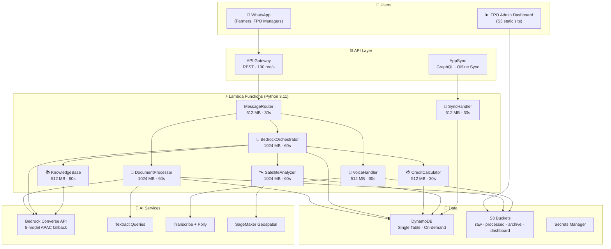
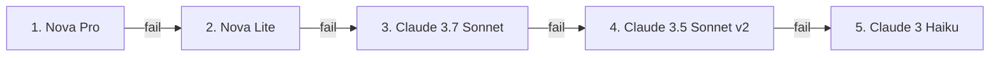

# 🌾 Kisan-Setu MVP — WhatsApp-Based Agricultural Assistant

AI-powered WhatsApp assistant for Indian farmers and FPOs using AWS Bedrock, Meta WhatsApp Business API, and serverless architecture.

> For the full architecture deep-dive, see [`architecture.md`](architecture.md)

---

## 🎯 Overview

Kisan-Setu helps farmers through WhatsApp by:
- Processing handwritten ledger images with multimodal LLM + Textract OCR
- Providing agricultural advice via AI (AWS Bedrock, 5-model fallback chain)
- Calculating credit scores (0–100) based on transaction history
- Analyzing satellite imagery for crop health (SageMaker Geospatial, NDVI)
- Supporting voice messages in Hindi, Marathi, and Tamil
- Offline-first sync for FPO managers (AppSync + GraphQL)
- FPO Admin Dashboard (S3-hosted: live feed, credit charts, NDVI map)

---

## 🏗️ Architecture



---

## 📋 Prerequisites

- AWS Account (Region: ap-south-1)
- Meta WhatsApp Business Account
- Python 3.11+
- Node.js 18+ (for AWS CDK)
- AWS CLI configured
- Docker (optional, recommended for Lambda packaging)

---

## 🚀 Quick Start

### 1. Install Dependencies

```bash
cd kisan-setu-mvp
python3 -m venv .venv
source .venv/bin/activate
pip install -r requirements.txt
npm install -g aws-cdk
```

### 2. Configure WhatsApp Credentials

```bash
export WHATSAPP_ACCESS_TOKEN="your_access_token_here"
./deploy_meta_whatsapp.sh
```

### 3. Deploy Infrastructure

```bash
cdk bootstrap aws://YOUR_ACCOUNT_ID/ap-south-1   # first time only
cdk deploy --require-approval never
```

### 4. Configure Webhook in Meta Dashboard

1. Go to Meta App Dashboard → Configuration → Webhooks
2. Set Callback URL: your API Gateway webhook URL (from CDK output)
3. Set Verify Token: `kisan-setu-verify-2026`
4. Subscribe to `messages` webhook field

---

## 📁 Project Structure

```
kisan-setu-mvp/
├── lambda/
│   ├── router/              # Message routing + webhook verification
│   ├── processor/           # Ledger digitization (LLM + Textract)
│   ├── voice/               # Transcribe + Polly voice processing
│   ├── orchestrator/        # Bedrock AI orchestration + tiered routing
│   ├── credit/              # Credit score calculation engine
│   ├── satellite/           # NDVI analysis + yield prediction
│   ├── knowledge/           # RAG-based knowledge retrieval
│   ├── sync/                # Offline sync (AppSync resolver)
│   ├── whatsapp/            # Meta WhatsApp Business API interface
│   └── common/              # Shared: models, validation, error handling,
│                            #   LLM adapter, encryption, cost optimization
├── dashboard/               # S3-hosted FPO admin dashboard
│   ├── index.html           # Responsive UI with stats, charts, maps
│   └── app.js               # Real-time updates, Chart.js, Leaflet.js
├── tests/                   # 55+ test files (unit + property-based + integration)
├── .github/workflows/       # CI/CD pipeline (5 parallel jobs)
├── infrastructure_stack.py  # CDK infrastructure
├── app.py                   # CDK app entry point
├── schema.graphql           # AppSync GraphQL schema
├── deploy.sh                # Full automated deployment (Docker)
├── build_lambda_packages.sh # Lambda package builder
├── deploy_meta_whatsapp.sh  # WhatsApp setup + deploy
├── seed_data.py             # DynamoDB seed script
├── cdk.json                 # CDK configuration
├── pytest.ini               # Test config
└── requirements.txt         # Python dependencies
```


---

## 🤖 LLM Resilience

5-model APAC inference profile fallback chain with per-model circuit breakers:



- Circuit breaker per model (3 failures → 60s cooldown)
- Exponential backoff retry (1s → 2s → 4s)
- Tiered model routing (simple/medium/complex queries)
- Multimodal support for image+text (ledger extraction)

---

## 🧪 Testing

```bash
# Run all tests
cd kisan-setu-mvp
pytest tests/ -v

# Property-based tests only
pytest tests/ -k "properties" -v
```

CI/CD pipeline (GitHub Actions) runs 5 parallel jobs: unit tests, property-based tests (Hypothesis), integration tests (LocalStack), code quality (black/flake8/pylint), security scan (bandit/safety).

---

## 📊 AWS Resources

### Lambda Functions (8 deployed via CDK)
- MessageRouter — Routes incoming messages + webhook verification
- DocumentProcessor — Ledger image processing (LLM + Textract)
- VoiceHandler — Voice transcription + TTS
- BedrockOrchestrator — AI conversation orchestration
- CreditCalculator — Credit scoring (0–100)
- SatelliteAnalyzer — NDVI satellite analysis
- KnowledgeBase — RAG-based agricultural knowledge
- SyncHandler — Offline sync (AppSync resolver)

### Storage
- DynamoDB: `KisanSetuData` (single-table design, on-demand, GSI1)
- S3 Buckets: `kisan-setu-raw-{acct}`, `kisan-setu-processed-{acct}`, `kisan-setu-archive-{acct}`, `kisan-setu-dashboard-{acct}`

### API
- API Gateway: REST webhook endpoint (GET/POST `/webhook`, POST `/process`, `/credit`, `/knowledge`)
- AppSync: GraphQL API for offline sync

### Monitoring
- CloudWatch Logs (all Lambdas)
- SNS Topic: `kisan-setu-critical-alerts`

---

## 🔐 Security

- WhatsApp credentials in AWS Secrets Manager
- Field-level encryption (KMS + Fernet) for sensitive data
- IAM roles with service-specific policies
- API Gateway throttling (100 req/s, burst 200)
- Webhook verification token validation
- Automatic audit trail on all data mutations

---

## 📚 Documentation

- [`architecture.md`](architecture.md) — Full architecture reference (Mermaid diagrams)
- [`kisan-setu-mvp/README.md`](kisan-setu-mvp/README.md) — Detailed project README
- [`IMPLEMENTATION_STATUS_AND_TASKS.md`](IMPLEMENTATION_STATUS_AND_TASKS.md) — Task flow & status
- [`TROUBLESHOOTING.md`](TROUBLESHOOTING.md) — Common issues & solutions
- [`FAQ.md`](FAQ.md) — Frequently asked questions
- [`kisan-setu-mvp/DEPLOYMENT_SCRIPTS.md`](kisan-setu-mvp/DEPLOYMENT_SCRIPTS.md) — Deployment script reference
- [`.kiro/specs/kisan-setu/SETUP-GUIDE.md`](.kiro/specs/kisan-setu/SETUP-GUIDE.md) — Step-by-step setup guide

---

## 🚨 Troubleshooting

See [`TROUBLESHOOTING.md`](TROUBLESHOOTING.md) for detailed solutions. Quick checklist:

1. Check CloudWatch logs for the relevant Lambda
2. Verify webhook URL matches CDK deployment output
3. Verify WhatsApp credentials in Secrets Manager
4. Verify Bedrock model access is enabled for all 5 models
5. Redeploy: `./deploy.sh`

---

## 🙏 Acknowledgments

Built with:
- AWS Bedrock (5-model APAC inference profile fallback: Nova Pro, Nova Lite, Claude 3.7 Sonnet, Claude 3.5 Sonnet v2, Claude 3 Haiku)
- AWS Textract, Transcribe, Polly
- SageMaker Geospatial
- Meta WhatsApp Business API
- AWS CDK (Python)

---

## 📝 License

MIT — AI for Bharat Hackathon 2026

---

**Status**: ✅ Production Ready | Meta WhatsApp Integration Active

**Last Updated**: March 9, 2026