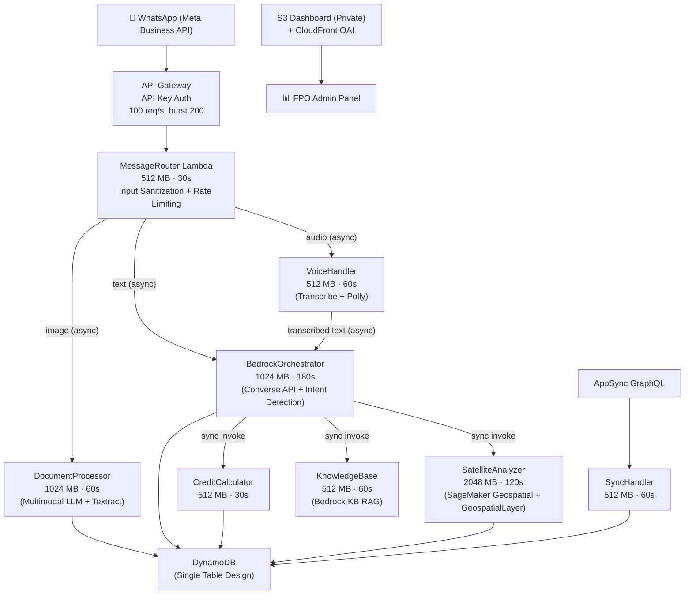
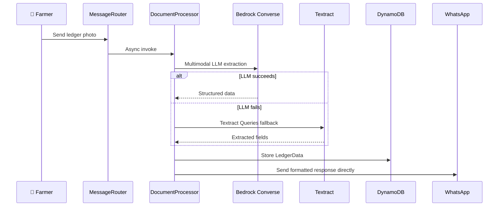
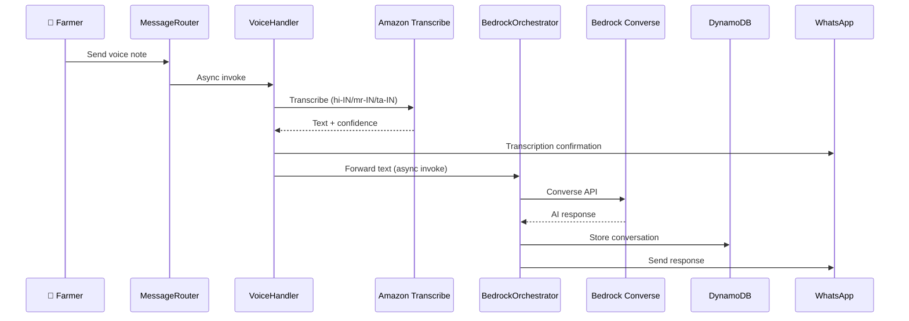
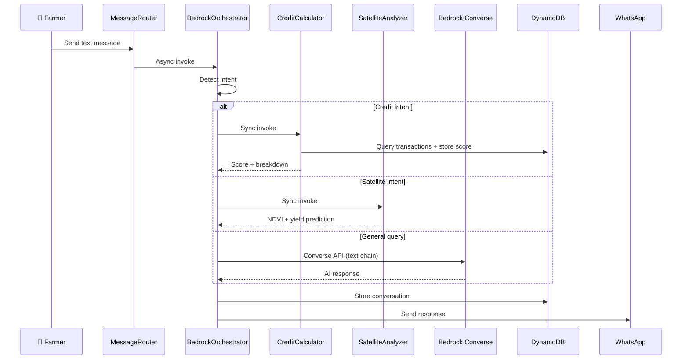
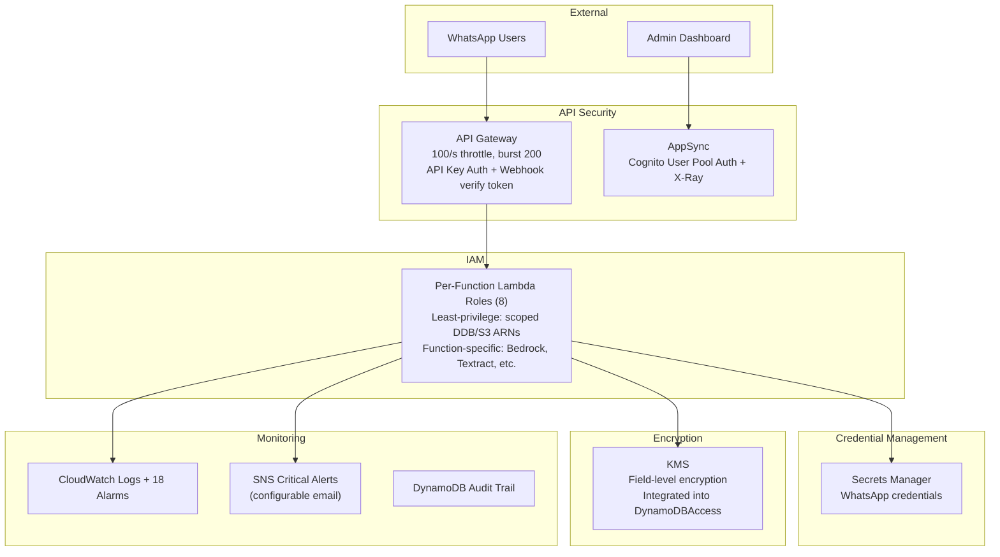

# 🌾 Kisan-Setu (किसान सेतु)

### An Agentic FPO Operating System

**The "Chief Intelligence Officer" for Farmer Producer Organizations**

*Voice-first, multimodal AI agent integrated directly into WhatsApp — zero typing, zero new apps.*

[](#cicd-pipeline)
[](#testing)
[](#prerequisites)
[](#architecture)
[](#license)

**Built for AI for Bharat Hackathon 2026**

[Live Dashboard](#dashboard) · [Architecture](#architecture) · [Quick Start](#quick-start) · [Testing](#testing)

</div>

---

## The Problem

Farmer Producer Organizations (FPOs) in rural India operate on handwritten "Kaccha" ledgers, voice conversations, and paper receipts. This unstructured data makes them invisible to banks, unable to access credit, and locked out of the formal economy. Existing apps like DeHaat require literate farmers to manually type data into forms — leading to low adoption.

## Our Solution

Kisan-Setu is the first **"Zero-UI" Operating System** for FPOs. By simply photographing receipts and sending voice notes on WhatsApp, the FPO passively builds a **"Digital Twin"** of its economy — unlocking efficiency and institutional credit.

**What makes it different:**

- **Beyond Chatbots** — While others build simple Q&A bots (RAG), we use AWS Bedrock with a 5-model fallback chain to perform complex actions: reasoning, calculating credit scores, and fetching external satellite data.
- **Deep Tech Integration** — We don't just "read" text; we use multimodal LLM vision (Bedrock Converse API) as primary extraction with Amazon Textract Queries as fallback, and SageMaker Geospatial for orbital crop analysis.
- **No App Friction** — Zero learning curve. The interface is WhatsApp, which 500M+ Indians already use.

---

## Features

### 📄 Handwritten Ledger Digitization
Extracts entities like Quantity, Moisture, Price, Crop Type, and Quality Grade from photos of crumpled paper receipts. Uses a dual-extraction strategy: **multimodal LLM (Bedrock Converse API with image input)** as primary, **Amazon Textract Queries** as fallback, with LLM post-processing to correct Textract errors. Supports Hindi, Marathi, and Tamil handwritten scripts.

### 🎤 Multilingual Voice Interface
Farmers speak in Hindi, Marathi, or Tamil; the AI responds in their dialect. Powered by **Amazon Transcribe** (speech-to-text) and **Amazon Polly** (neural text-to-speech). VoiceHandler transcribes audio then forwards the text to BedrockOrchestrator for AI processing. No typing required.

### 🛰️ Satellite Yield Estimation
Automated NDVI (Normalized Difference Vegetation Index) analysis based on GPS coordinates to predict crop maturity and estimate harvest volume. Powered by **Amazon SageMaker Geospatial** with Sentinel-2 imagery. Includes 24-hour DynamoDB caching and PIL-based NDVI heatmap rendering.

### 💳 Automated Credit Scoring
Generates reliability scores (0–100) for farmers based on five weighted components:
- Supply Consistency (0–30)
- Quality Metrics (0–25)
- Transaction History (0–20)
- Financial Behavior (0–15)
- Operational Transparency (0–10)

Farmers can't get loans because they have no credit history. By digitizing their daily paper logs, Kisan-Setu inadvertently builds an **Alternative Credit Score**, making them bankable.

### 📱 Offline-First Sync
Tablet mode for FPO managers that works without internet, syncing when connectivity returns. Powered by **AWS AppSync** with GraphQL, last-write-wins conflict resolution, and version-based optimistic locking.

### 🤖 Intelligent Orchestration
Tiered model routing for cost optimization:
- **Complex queries** (credit analysis, crop advice, multi-step reasoning) → Nova Pro
- **Standard queries** (general farming questions) → Nova Pro
- **Simple queries** (greetings, FAQs, status checks) → Nova Lite

Daily cost threshold enforcement ($2.00/day) automatically downgrades to cheaper models when budget is exceeded.

### 📊 FPO Admin Dashboard
Responsive web dashboard served via CloudFront (private S3 bucket with OAI) with:
- Live WhatsApp message feed (real-time updates)
- Credit score trend charts (0-100 scale, Chart.js)
- Satellite NDVI crop health map (Leaflet.js + OpenStreetMap)
- Ledger digitization preview (before/after)

---

## Architecture



> **Routing facts**: Router validates input (2000 char limit, injection detection, per-sender rate limiting at 10 msg/min), then invokes DocumentProcessor, VoiceHandler, or BedrockOrchestrator. VoiceHandler forwards transcribed text to Orchestrator. Orchestrator invokes CreditCalculator, SatelliteAnalyzer, and KnowledgeBase.

### Lambda Functions (8 total)

| Function | Purpose | Runtime | Memory | Timeout |
|----------|---------|---------|--------|---------|
| **MessageRouter** | Routes WhatsApp messages by type | Python 3.11 | 512 MB | 30s |
| **DocumentProcessor** | Ledger extraction (multimodal LLM + Textract) | Python 3.11 | 1024 MB | 60s |
| **VoiceHandler** | Transcription + forwards to Orchestrator | Python 3.11 | 512 MB | 60s |
| **BedrockOrchestrator** | AI conversation + intent detection + tool use | Python 3.11 | 1024 MB | 180s |
| **CreditCalculator** | Reliability score computation (0-100) | Python 3.11 | 512 MB | 30s |
| **SatelliteAnalyzer** | NDVI + yield prediction + heatmap rendering | Python 3.11 | 2048 MB | 120s |
| **KnowledgeBase** | RAG-based agricultural knowledge | Python 3.11 | 512 MB | 60s |
| **SyncHandler** | AppSync offline sync resolver | Python 3.11 | 512 MB | 60s |

---

## Data Flow Diagrams

### Image (Ledger) Processing



### Voice Processing



### Text Processing with Intent Detection



---

## Security Architecture



---

## Technology Stack

| Layer | Service | Purpose |
|-------|---------|---------|
| **Core AI/LLM** | AWS Bedrock (Converse API) | Reasoning, tool use, multimodal image understanding |
| **Text Fallback Chain** | Nova Pro → Nova Lite → Claude 3.7 Sonnet → Claude 3.5 Sonnet v2 → Claude 3 Haiku | 5-model resilience with circuit breakers (APAC inference profiles) |
| **Multimodal Chain** | Claude 3.7 Sonnet → Claude 3.5 Sonnet v2 → Nova Pro → Claude 3 Haiku → Nova Lite | Image processing fallback chain |
| **Computer Vision** | Amazon Textract Queries | Handwritten ledger extraction (fallback to LLM) |
| **Geospatial** | Amazon SageMaker Geospatial | Sentinel-2 satellite imagery, NDVI crop monitoring |
| **Voice** | Amazon Transcribe + Amazon Polly | Speech-to-text (hi-IN, mr-IN, ta-IN) + neural TTS |
| **Compute** | AWS Lambda (Serverless) | 8 functions, Python 3.11, pay-per-use |
| **Database** | Amazon DynamoDB | Single-table design, on-demand billing |
| **Storage** | Amazon S3 | Raw uploads, processed data, archive, dashboard hosting |
| **API** | Amazon API Gateway | WhatsApp webhook, REST endpoints |
| **Offline Sync** | AWS AppSync | GraphQL API with conflict resolution |
| **Alerts** | Amazon SNS | Critical error notifications |
| **Secrets** | AWS Secrets Manager | WhatsApp credentials |
| **IaC** | AWS CDK (Python) | Infrastructure as code |
| **CI/CD** | GitHub Actions | Unit, property-based, integration, security tests |

---

## LLM Adapter & Resilience

The system uses a custom `LLMAdapter` with production-grade resilience patterns:

- **5-model text fallback chain** — Nova Pro → Nova Lite → Claude 3.7 Sonnet → Claude 3.5 Sonnet v2 → Claude 3 Haiku
- **5-model multimodal chain** — Claude 3.7 Sonnet → Claude 3.5 Sonnet v2 → Nova Pro → Claude 3 Haiku → Nova Lite
- **Circuit breaker pattern** — after 3 consecutive failures, a model is temporarily removed from rotation (60s cooldown)
- **Exponential backoff retry** — retryable errors (throttling, timeouts) are retried with 1s → 2s → 4s delays
- **Token usage tracking** — input/output tokens logged per request for cost monitoring
- **Daily cost threshold** — auto-downgrade to cheapest model when daily cost exceeds $2.00

---

## Cost Estimation

**Serverless "Pay-as-you-go" model — near zero cost when idle.**

| Resource | Monthly Cost |
|----------|-------------|
| DynamoDB (on-demand) | < $5 |
| AI Inference (Bedrock + Textract) | ~$0.01 per document/query |
| Lambda compute | $5–10 |
| S3 storage | $1–2 |
| Transcribe + Polly | $2–5 |
| API Gateway | $1–2 |
| **Total per FPO cluster (500+ farmers)** | **< $50/month** |

**Cost optimization strategies:**
- Bedrock Knowledge Bases for RAG retrieval, reducing expensive long-context prompting by ~40%
- Tiered model routing — simple queries use cheap models, complex queries use capable models
- Daily cost threshold enforcement ($2.00/day) — automatic downgrade when budget exceeded
- 24-hour satellite imagery caching in DynamoDB
- Nova-first model selection (cheaper AWS models before Claude)

---

## Quick Start

### Prerequisites
- AWS Account with Bedrock model access (ap-south-1)
- Python 3.11+
- Node.js 18+ (for CDK)
- AWS CLI configured
- Meta WhatsApp Business Account

### Setup

```bash
# Clone and install
cd kisan-setu-mvp
python3 -m venv .venv
source .venv/bin/activate
pip install -r requirements.txt
```

```bash
# Enable Bedrock models (AWS Console → Bedrock → Model access)
# Request: Nova Pro, Nova Lite, Claude 3.7 Sonnet, Claude 3.5 Sonnet v2, Claude 3 Haiku
# (Nova models are prioritized; Claude models require APAC Marketplace subscription)
```

```bash
# Store WhatsApp credentials
aws secretsmanager create-secret \
  --name kisan-setu/whatsapp/credentials \
  --secret-string '{"PHONE_NUMBER_ID":"your_id","ACCESS_TOKEN":"your_token","VERIFY_TOKEN":"kisan-setu-verify-2026"}' \
  --region ap-south-1
```

```bash
# Deploy
cdk deploy --context account=YOUR_ACCOUNT_ID --context region=ap-south-1 --require-approval never
```

```bash
# Configure Meta webhook with the WebhookURL from deployment output
# Verify token: kisan-setu-verify-2026
```

---

## Testing

**633 tests passed, 0 failed, 10 skipped**

The test suite includes unit tests, integration tests, and property-based tests (Hypothesis).

```bash
# Run all tests
python -m pytest tests/ --tb=short -q

# Property-based tests only
pytest tests/ -k "properties" -v

# With coverage
pytest tests/ --cov=lambda --cov-report=html
```

### CI/CD Pipeline

GitHub Actions runs 5 parallel jobs on every push:

1. **Unit Tests** — with coverage reporting (pytest-xdist parallel execution)
2. **Property-Based Tests** — Hypothesis with 100 iterations per property
3. **Integration Tests** — LocalStack + DynamoDB Local
4. **Code Quality** — Black, isort, flake8, pylint
5. **Security Scan** — Bandit (SAST) + Safety (dependency vulnerabilities)

---

## Project Structure

```
kisan-setu-mvp/
├── lambda/
│   ├── router/              # Message routing + webhook verification
│   ├── processor/           # Ledger digitization (multimodal LLM + Textract)
│   ├── voice/               # Transcribe + forward to Orchestrator
│   ├── orchestrator/        # Bedrock AI orchestration + tiered routing + intent detection
│   ├── credit/              # Credit score calculation engine (0-100)
│   ├── satellite/           # NDVI analysis + yield prediction + heatmap rendering
│   ├── knowledge/           # RAG-based knowledge retrieval (Bedrock KB)
│   ├── sync/                # Offline sync (AppSync Lambda resolver)
│   ├── whatsapp/            # Meta WhatsApp Business API interface
│   └── common/              # Shared: models, validation, error handling,
│                            #   LLM adapter, encryption, cost optimization
├── dashboard/               # S3-hosted FPO admin dashboard
│   ├── index.html           # Responsive UI with stats, charts, maps
│   └── app.js               # Real-time updates, Chart.js, Leaflet.js
├── tests/                   # 633 tests (unit + property-based + integration)
├── .github/workflows/       # CI/CD pipeline (5 parallel jobs)
├── infrastructure_stack.py  # CDK infrastructure (8 Lambdas, API GW, AppSync, S3, SNS)
├── app.py                   # CDK entry point
├── schema.graphql           # AppSync GraphQL schema for offline sync
├── requirements.txt         # Python dependencies
├── cdk.json                 # CDK configuration
├── deploy.sh                # Automated deployment (Docker)
├── build_lambda_packages.sh # Manual Lambda packaging
└── deploy_meta_whatsapp.sh  # Quick WhatsApp deployment
```

---

## Social Impact & Scalability

**Financial Inclusion** — By digitizing the "first mile" of agriculture, we generate the data banks need to lend to farmers. Every photographed receipt builds their credit history.

**Sustainability** — Satellite-driven advice prevents fertilizer overuse and optimizes harvest timing, reducing waste.

**Deployment Readiness** — The solution uses established AWS patterns (Serverless + Bedrock), ensuring it is robust enough for immediate pilot deployment in Maharashtra's onion belt.

---

## Monitoring & Troubleshooting

```bash
# Tail Lambda logs
aws logs tail /aws/lambda/FUNCTION_NAME --follow --region ap-south-1

# List deployed functions
aws lambda list-functions --query "Functions[?contains(FunctionName, 'KisanSetu')].FunctionName"

# Check CloudWatch alarm states
aws cloudwatch describe-alarms --alarm-name-prefix "kisan-setu" \
  --query "MetricAlarms[].{Name:AlarmName,State:StateValue}" --output table --region ap-south-1
```

See [TROUBLESHOOTING.md](../TROUBLESHOOTING.md) for common issues and solutions.

### Security Features
- API Gateway: API key authentication on `/process`, `/credit`, `/knowledge`
- AppSync: Cognito User Pool authorization
- S3 Dashboard: Private bucket + CloudFront OAI
- DynamoDB: KMS field-level encryption via `DynamoDBAccess`
- Router: Input sanitization (2000 char limit, injection detection, special char filtering)
- Router: Per-sender rate limiting (10 msg/min, DynamoDB atomic counters with TTL)
- Per-function IAM roles: 8 individual least-privilege roles (DynamoDB/S3 scoped to specific ARNs)
- All Lambdas: Module-level lazy init for warm invocation reuse
- Conversation TTL: 30-day auto-expiry

### Production Readiness (Phase 6)
- 18 CloudWatch alarms: Errors + Throttles per Lambda, API Gateway 5xx + p99 latency
- SNS email alerts: Configurable via `cdk deploy -c alert_email=ops@example.com`
- DynamoDB PITR: Point-in-Time Recovery enabled (35-day restore window)
- Provisioned concurrency: Router + Orchestrator with PC=2 (eliminates cold starts)
- Live dashboard: Real API data (farmer map, credit charts, message feed) with 5s polling
- Idempotent seed script: Conditional writes prevent data overwrite on re-runs

---

## License

MIT

## Contributors

**Upmanyu Jha** — Machine Learning Engineer

Built for the AI for Bharat 2026 initiative Powered by AWS.
