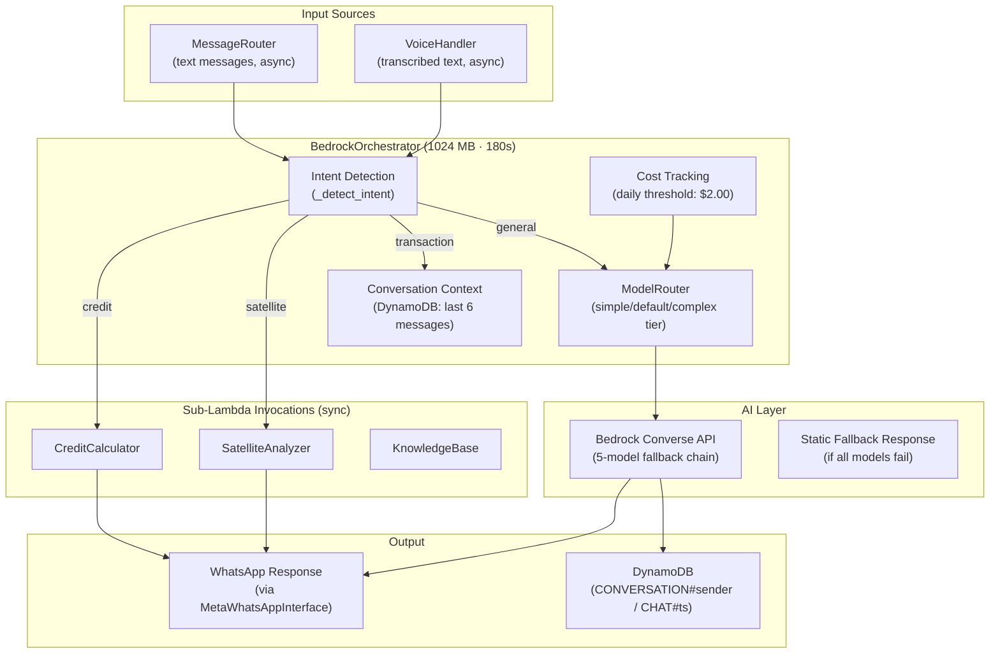
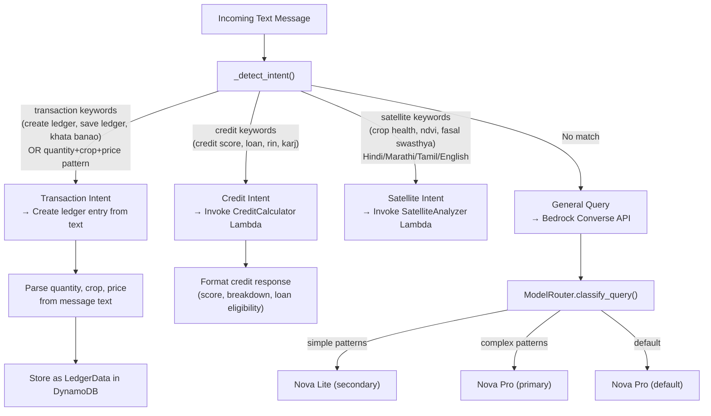

# Bedrock Orchestration Component

## Overview

The Bedrock Orchestration Component is the central AI brain of Kisan-Setu. It handles all text-based interactions, performs intent detection, invokes sub-Lambdas (CreditCalculator, SatelliteAnalyzer, KnowledgeBase), and maintains conversation context.

It uses the LLM Adapter with a 5-model APAC inference profile fallback chain via the Bedrock Converse API. The text model fallback chain is: Nova Pro → Nova Lite → Claude 3.7 Sonnet → Claude 3.5 Sonnet v2 → Claude 3 Haiku. Each model has a circuit breaker (3 failures → 60s cooldown) and exponential backoff retries.

## Architecture



## Intent Detection Flow



## Features

- **Intent Detection**: Pattern-matching for credit, satellite, transaction, and general queries (supports Hindi, Marathi, Tamil, English)
- **Task Decomposition**: Breaks complex requests into ordered sub-tasks with dependencies
- **Sub-Lambda Invocation**: Calls CreditCalculator, SatelliteAnalyzer, KnowledgeBase via synchronous `lambda:InvokeFunction`
- **Voice Ledger Creation**: Parses transaction data from voice transcriptions (quantity + crop + price patterns)
- **Conversation Context**: Stores/retrieves last 6 messages from DynamoDB (`CONVERSATION#{sender}` / `CHAT#{ts}#role`)
- **Tiered Model Routing**: Classifies queries as simple/default/complex for cost optimization
- **Daily Cost Threshold**: Auto-downgrades to Nova Lite when daily cost exceeds $2.00
- **Static Fallback**: Returns hardcoded helpful response if all 5 models fail
- **Multilingual Support**: System prompt enforces language consistency (Hindi, Marathi, Tamil, English)

## Requirements Implemented

- **Requirement 7.1**: Decompose complex multi-step requests into sub-tasks
- **Requirement 7.2**: Invoke appropriate tools and combine results
- **Requirement 7.3**: Perform mathematical calculations accurately
- **Requirement 7.4**: Maintain conversation history and reference prior interactions
- **Requirement 7.5**: Handle errors gracefully and inform user of partial results

## Lambda Configuration

| Property | Value |
|----------|-------|
| Runtime | Python 3.11 |
| Memory | 1024 MB |
| Timeout | 180s |
| Handler | `orchestrator.handler` |

## Environment Variables

| Variable | Purpose |
|----------|---------|
| `DYNAMODB_TABLE` | DynamoDB table name (default: `KisanSetuData`) |
| `REGION` | AWS region (default: `ap-south-1`) |
| `DOCUMENT_PROCESSOR_FUNCTION` | DocumentProcessor Lambda function name |
| `VOICE_AGENT_FUNCTION` | VoiceHandler Lambda function name |
| `SATELLITE_ANALYZER_FUNCTION` | SatelliteAnalyzer Lambda function name |
| `CREDIT_CALCULATOR_FUNCTION` | CreditCalculator Lambda function name |
| `KNOWLEDGE_BASE_FUNCTION` | KnowledgeBase Lambda function name |
| `WHATSAPP_SECRET_NAME` | Secrets Manager secret for WhatsApp credentials |
| `DAILY_COST_THRESHOLD` | Daily cost limit in USD (default: `2.0`) |

## Tool Mapping

| Tool Name | Lambda Function |
|-----------|----------------|
| `document_processor` / `textract` | DocumentProcessor |
| `voice_agent` / `transcribe` | VoiceHandler |
| `satellite_analyzer` / `sagemaker` | SatelliteAnalyzer |
| `credit_calculator` | CreditCalculator |
| `knowledge_base` / `retrieve_and_generate` | KnowledgeBase |

## DynamoDB Key Patterns

| Entity | PK | SK |
|--------|----|----|
| Conversation Chat | `CONVERSATION#{sender_id}` | `CHAT#{timestamp}#user` or `CHAT#{timestamp}#assistant` |
| Model Cost Tracking | `SYSTEM#MODEL_COSTS` | `MODEL_COST#{date}` |

## Testing

```bash
pytest tests/test_orchestrator.py -v
```
