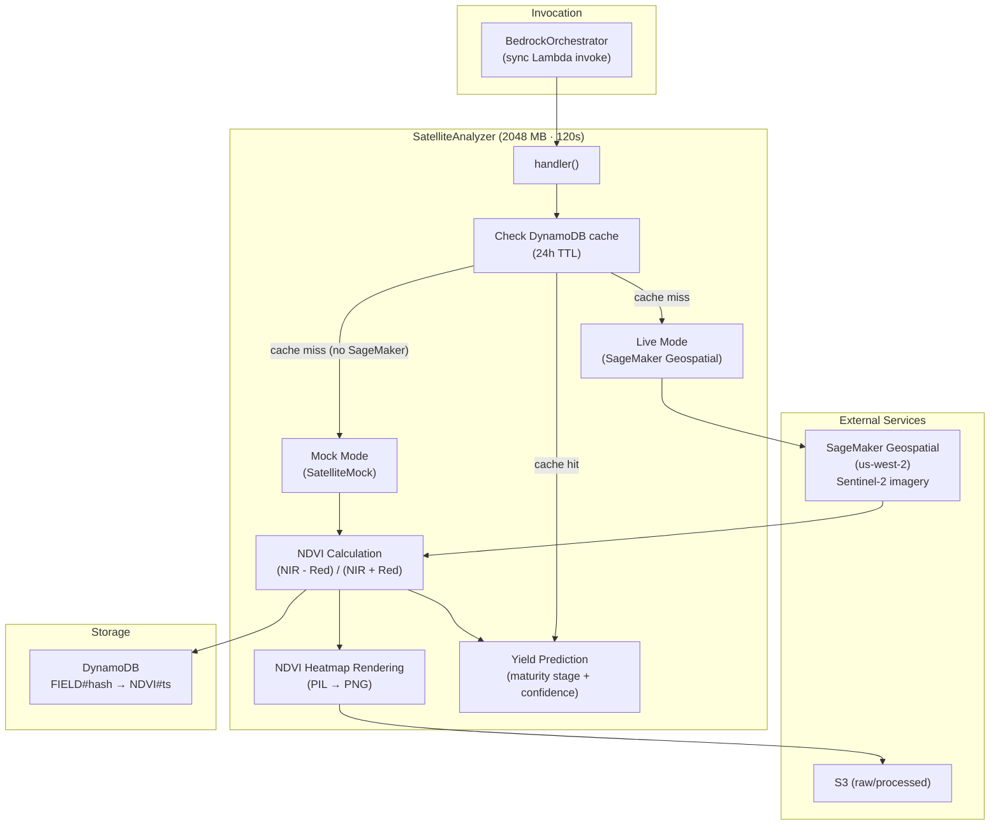
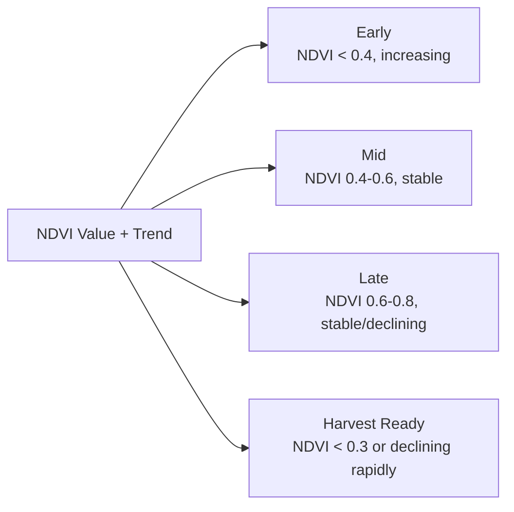

# Satellite Analyzer Component

## Overview

The Satellite Analyzer retrieves satellite imagery and calculates NDVI (Normalized Difference Vegetation Index) for crop yield prediction. It integrates with AWS SageMaker Geospatial for Sentinel-2 satellite imagery and implements 24-hour DynamoDB caching. It also renders NDVI heatmaps as PNG images using PIL.

## Architecture



## Lambda Configuration

| Property | Value |
|----------|-------|
| Runtime | Python 3.11 |
| Memory | **2048 MB** |
| Timeout | **120s** |
| Handler | `satellite_analyzer.handler` |
| Layers | GeospatialLayer (rasterio, pyproj, numpy) |

## Features

- **Satellite Imagery Retrieval**: Fetches Sentinel-2 imagery via SageMaker Geospatial (region: `us-west-2`)
- **NDVI Calculation**: `(B8 - B4) / (B8 + B4)` where B8=NIR, B4=Red
- **NDVI Heatmap Rendering**: PIL-based PNG generation of NDVI spatial data
- **Crop Maturity Classification**: Early, Mid, Late, Harvest Ready based on NDVI trends
- **Yield Prediction**: Estimates crop yield volume based on NDVI history and crop type
- **Cloud Cover Handling**: Adjusts confidence scores based on cloud cover percentage
- **24-Hour Caching**: DynamoDB-backed cache (`FIELD#{coords_hash}` / `NDVI#{timestamp}`)
- **Mock Mode**: `SatelliteMock` provides deterministic NDVI for demo (Maharashtra bounds, 8 crop types)

## NDVI Value Interpretation

| NDVI Range | Meaning |
|------------|---------|
| -1.0 to 0.0 | Water, bare soil, non-vegetated |
| 0.0 to 0.3 | Sparse vegetation, stressed crops |
| 0.3 to 0.6 | Moderate vegetation, growing crops |
| 0.6 to 0.8 | Dense vegetation, healthy mature crops |
| 0.8 to 1.0 | Very dense vegetation |

## Maturity Stage Classification



## Crop Yield Factors (tons/hectare)

| Crop | Base Yield |
|------|------------|
| Onion | 25.0 |
| Tomato | 30.0 |
| Potato | 20.0 |
| Wheat | 4.0 |
| Rice | 5.0 |
| Cotton | 2.5 |

Actual yield = Base Yield × NDVI Factor (0.3 to 1.0)

## Environment Variables

| Variable | Purpose |
|----------|---------|
| `DYNAMODB_TABLE` | DynamoDB table name |
| `S3_BUCKET_RAW` | Raw data bucket |
| `S3_BUCKET_PROCESSED` | Processed data bucket |
| `REGION` | Primary region (`ap-south-1`) |
| `SAGEMAKER_REGION` | SageMaker Geospatial region (`us-west-2`) |
| `SENTINEL2_ARN` | Sentinel-2 raster data collection ARN |
| `SNS_ALERT_TOPIC_ARN` | Critical alerts topic |

## Actions

| Action | Input | Output |
|--------|-------|--------|
| `get_imagery` | `gps_coords`, `date_range` | Satellite image data |
| `calculate_ndvi` | `gps_coords` | NDVI value + confidence |
| `predict_yield` | `gps_coords`, `crop_type` | Yield estimate + maturity stage |

## Testing

```bash
pytest tests/test_satellite_analyzer.py -v
pytest tests/test_satellite_properties.py -v
```
