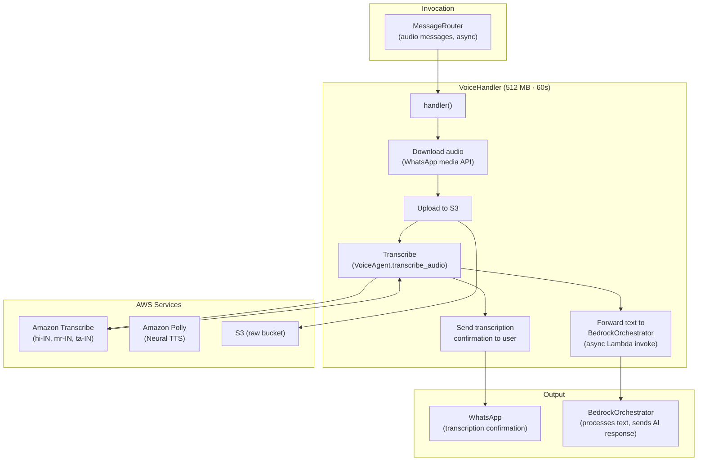
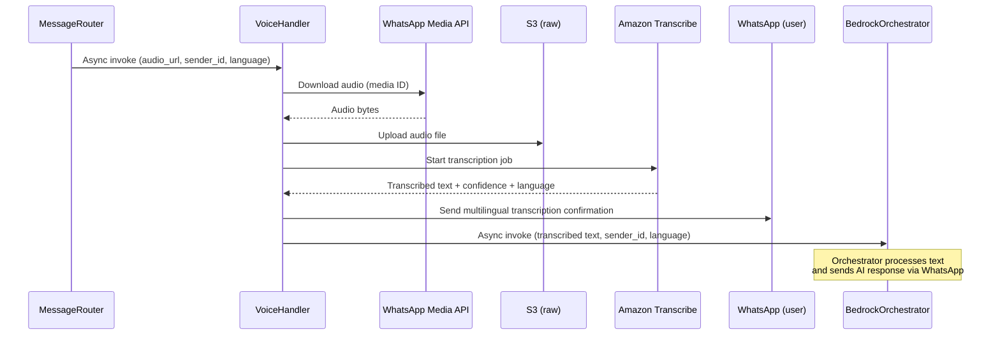

# Voice Agent Component

## Overview

The Voice Agent provides multilingual voice processing for Kisan-Setu. It transcribes voice messages using Amazon Transcribe, sends a transcription confirmation to the user, then forwards the transcribed text to BedrockOrchestrator for AI processing. It also supports text-to-speech synthesis via Amazon Polly.

## Architecture



## Voice Message Processing Flow



## Lambda Configuration

| Property | Value |
|----------|-------|
| Runtime | Python 3.11 |
| Memory | 512 MB |
| Timeout | 60s |
| Handler | `voice.handler` |

## Supported Languages

| Language | Code | Transcribe | Polly Voice |
|----------|------|------------|-------------|
| Hindi | hi-IN | ✅ | Aditi (Neural) |
| Marathi | mr-IN | ✅ | — |
| Tamil | ta-IN | ✅ | — |

## Actions

| Action | Input | Output |
|--------|-------|--------|
| `transcribe` | `audio_url`, `language` (hint), `sender_id` | Transcribed text + confidence + detected language |
| `synthesize` | `text`, `language`, `voice_id` (optional) | S3 presigned URL to audio (1h validity) |
| `detect_language` | `audio_url` | Detected language code |

## Audio Format Support

OGG, MP3, WAV, M4A, FLAC, AMR, WebM (auto-detected from WhatsApp content type)

## Key Behavior

- On `transcribe` action: Downloads audio → uploads to S3 → transcribes → sends WhatsApp confirmation → forwards text to BedrockOrchestrator (async)
- The Orchestrator (not VoiceHandler) generates and sends the AI response
- Error messages are sent to user in their detected language (Hindi, Marathi, Tamil, English)

## Environment Variables

| Variable | Purpose |
|----------|---------|
| `S3_BUCKET_RAW` | Raw audio storage bucket |
| `S3_BUCKET_PROCESSED` | Processed audio/transcripts bucket |
| `REGION` | AWS region (`ap-south-1`) |
| `WHATSAPP_SECRET_NAME` | Secrets Manager secret for WhatsApp |
| `SNS_ALERT_TOPIC_ARN` | Critical alerts topic |

## Testing

```bash
pytest tests/test_voice_agent.py -v
```
