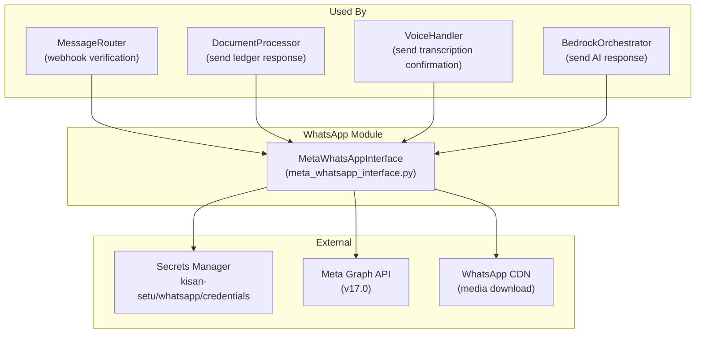
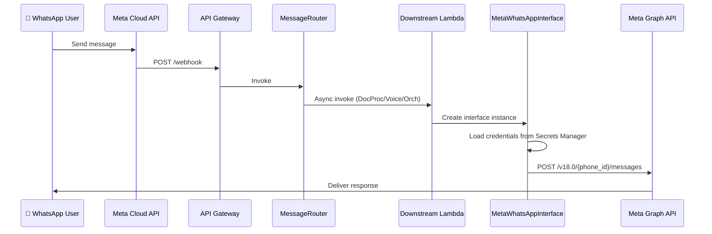

# WhatsApp Interface Component

## Overview

This directory contains the WhatsApp Interface Component for Kisan-Setu, using Meta WhatsApp Business Cloud API (v18.0). The primary class `MetaWhatsAppInterface` handles all WhatsApp communication. Webhook handling is done by the MessageRouter Lambda (`lambda/router/router.py`).

## Architecture



## Components

### `meta_whatsapp_interface.py`

The main `MetaWhatsAppInterface` class that handles all WhatsApp communication.

**Capabilities:**
- **Credential loading**: From AWS Secrets Manager (`kisan-setu/whatsapp/credentials`) with env var fallback
- **Send text**: `send_text_response(phone, message, language)` via Meta Graph API (v18.0)
- **Send voice**: `send_voice_response(phone, audio_url)` for audio responses
- **Send image**: `send_image(phone, image_url, caption)` for image messages
- **Send document**: `send_document(phone, document_url, caption, filename)` for PDFs/Excel
- **Receive message**: `receive_message(webhook_payload)` — parse Meta webhook into `WhatsAppMessage` objects
- **Media download**: `download_media(media_id)` — fetch images/audio from WhatsApp CDN, upload to S3
- **Multilingual fallback**: Welcome messages and error messages in English, Hindi, Marathi, Tamil
- **Rate limit handling**: Detection of Meta API rate limit errors (codes 4, 80007)
- **Formatting**: Tables (`format_table`), numbered/bullet lists (`format_list`), structured data (`format_structured_data`)

> **Note**: `webhook_handler.py` was removed in Phase 5 cleanup. All webhook handling is done by MessageRouter (`lambda/router/router.py`).

## Message Flow



## WhatsApp Credentials

Stored in AWS Secrets Manager (`kisan-setu/whatsapp/credentials`):

```json
{
  "PHONE_NUMBER_ID": "1043444535519617",
  "ACCESS_TOKEN": "your_access_token",
  "VERIFY_TOKEN": "kisan-setu-verify-2026"
}
```

## Environment Variables

| Variable | Purpose |
|----------|---------|
| `WHATSAPP_SECRET_NAME` | Secrets Manager secret name (`kisan-setu/whatsapp/credentials`) |
| `WEBHOOK_VERIFY_TOKEN` | Webhook verification token (`kisan-setu-verify-2026`) |

## Testing

```bash
pytest tests/test_webhook_handler.py -v
```

## Consumers

The `MetaWhatsAppInterface` class is used by multiple Lambda functions (each has its own copy in `common/`):
- **MessageRouter** — webhook verification, media download
- **DocumentProcessor** — send ledger extraction results directly to user
- **VoiceHandler** — send transcription confirmation
- **BedrockOrchestrator** — send AI responses
